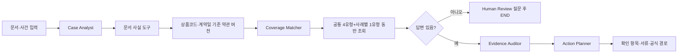

# 2026 금융 AI Challenge 예선 준비도 보고서

## Executive Summary

- **현재 판정: 1위 경쟁이 가능한 상위권 설계지만, 1위를 보장할 근거는 없다.** 2026 대회 공개 안내에서 확인되는 핵심은 금융 현안 해결, 실제 작동 웹서비스, 기획서·기능명세서·배포 URL이며 세부 가중치는 공개되지 않았다. ([DAKER 대회 안내](https://daker.ai/public/hackathons/2026-finance-ai-challenge))
- **가장 강한 증거는 “AI를 썼다”가 아니라 “가입 당시 약관을 고르고, 근거가 부족하면 멈추고, 다음 행동까지 만든다”는 실제 흐름이다.** 공식 우체국보험 2개 상품·3개 버전의 원문·페이지·해시와 LangGraph 실행 trace가 배포 MVP에 연결되어 있다.
- **가장 큰 리스크는 실제 데이터의 범위다.** 공식 약관은 실제지만 개인 보험가입증서·진료기록·보험사 청구 이력과 평가 사실관계는 합성 또는 미공개다. 따라서 보험금 지급 정확도나 모든 보험사 일반화를 주장하면 안 된다.
- **제출 전 결정은 기능 확장이 아니라 증거 고정이다.** 공식 HWPX 내용 이식과 구조 검증은 완료했다. 구성원 실명 입력·한컴 PDF 렌더 확인, 90초 심사자 실행 경로, 실패 사례 캡처, URL 접근 기간 smoke test를 우선하고 새 모델·새 Agent는 추가하지 않는다.

## 핵심 발견 1 — 공식 요구와 현재 MVP의 증명 경로가 맞물린다

| 심사자가 묻는 질문 | 현재 증거 | 해석 | 결정 |
|---|---|---|---|
| 금융 현안인가? | 금융위원회는 2026년 7월 찾아가야 할 숨은보험금 10.3조 원과 2025년 약 80만 건·3조 2,470억 원 환급을 발표했다. ([원문](https://www.fsc.go.kr/po010103/87270)) | “몰라서 확인을 시작하지 못하는 문제”를 수치와 연결할 수 있다. | 통계는 기준일과 원문을 붙여 사용한다. |
| 실제 불편인가? | 보험연구원 불만족 응답자 179명 중 청구 절차 불편 1순위 39.7%, 보험개발원 제29차 장기손해보험(상해) 종합 69.6점 `보통` | 문제를 채널 부재보다 문서·절차 해석 부담으로 설명할 수 있다. | 조사 하위표본과 평가대상 15개 상품의 범위를 함께 표시한다. |
| 실제 서비스인가? | 배포 URL에서 사례 선택, 질문, 결과, 공식 원문, Action Pack, 평가 API를 확인할 수 있다. | 문서가 아니라 실행 가능한 제출물이라는 점을 증명한다. | 심사자용 90초 runbook을 고정한다. |

**결정적 의미:** 문제 정의는 충분히 강하다. 단, 가족 보호자는 직접 인터뷰로
검증된 사용자 통계가 아니라 제품 설계 가설이므로 “고령층 전체를 대표한다”는
표현은 사용하지 않는다.

## 핵심 발견 2 — Agent성은 프레임워크 이름보다 분기 행동에서 드러난다

현재 실제 실행 경로는 다음과 같다.

근거는 [`lib/claim-guide/agent-graph.ts`](../lib/claim-guide/agent-graph.ts)와
[`components/claim-guide/demo/agent-flow-graph.tsx`](../components/claim-guide/demo/agent-flow-graph.tsx)에
있다. 화면은 읽기 위한 고정 노드 배치에 실제 실행 trace의 상태·입력·출력을
덧입힌다. 동의형 AI 문서 이해는 LangGraph 시작 전 선택 전처리이며 외부 호출
시간은 표시하지 않는다.

**해석:** “멀티에이전트가 많다”는 점수 요소가 아니다. 첫 호출은 질문 상태에서
종료하고, 사용자가 답하면 같은 사건·문서에 답변을 넣어 전체 그래프를 다시
호출한다. 현재는 체크포인터 기반 중단 지점 재개가 아니다.

**결정:** 현재의 단일 상태 그래프와 제한된 전문 Agent를 유지한다. 범용 LLM 약관
검색이나 임베딩 RAG를 제출 직전에 추가하지 않는다.

## 핵심 발견 3 — 실제성은 좁지만, provenance가 공개되어 신뢰를 만든다

| 데이터 층위 | 현재 범위 | 심사자에게 공개할 사실 |
|---|---|---|
| 공식 실제 원문 | 우체국보험 2개 상품·3개 버전, 금융감독원·국가법령정보센터 표준약관 | 상품코드·판매기간·적용일·쪽수·SHA-256·공식 URL |
| 합성 시연 문서 | 보험가입증서·진료자료·사고 사실 | 실제 개인정보·보험사 청구 이력은 사용하지 않음 |
| 평가 데이터 | 규칙 경계값 회귀 50건·규칙 재확인 경계 15건·공식 근거 미연결 안전 중단 2건 | 모두 answer=no인 합성 점검이며 실제 지급 정확도·질문 대기·AI 품질 아님 |
| 외부 AI | 동의 시 Workers AI 문서 변환·마스킹된 누락 사실 후보 | 보장 상태·약관 인용·금액은 AI가 결정하지 않음 |

근거 장부는 [`data/policies/manifest.json`](../data/policies/manifest.json),
[`docs/claim-evidence-matrix.md`](./claim-evidence-matrix.md),
[`docs/source-rights-and-official-sources.md`](./source-rights-and-official-sources.md)에
분리되어 있다.

**해석:** 데이터 범위를 넓게 보이게 하는 것보다, 실제·합성·미공개를 분리하는
편이 금융 서비스 심사에서 더 강하다.

**결정:** MVP의 공식 근거 범위를 2개 상품·3개 버전으로 고정하고, “모든 보험사에
적용된다” 또는 “받을 금액을 계산한다”는 표현을 삭제한다.

## 핵심 발견 4 — 시각화는 장식이 아니라 검증 순서를 압축한다

현재 UI의 React Flow 실행 캔버스는 다음 세 질문에 답한다.

1. 지금 어떤 Agent 또는 도구가 실행됐는가?
2. 왜 사용자에게 추가 질문을 했는가?
3. 결과의 근거가 어느 약관 조항과 페이지에서 왔는가?

이는 [`docs/submission-visuals.md`](./submission-visuals.md)와 실제 실행 캔버스
구현에 기록된 설계 원칙에 따른다. 단, 시각화 효과 자체는 아직 대규모 사용자
평가로 검증된 사실이 아니라 팀의 UX 가설이다.

**결정:** 기본 화면은 사례 선택 → 질문 → 결과에 집중하고, 실행 trace·근거 대장·
평가 수치는 심사자가 요청하거나 분석이 끝난 뒤 전면화한다. 정보량을 늘려
Agent성을 설명하지 않는다.

## 제출 전 권고 다음 단계

| 우선순위 | 다음 단계 | 완료 증거 | 미완료 시 리스크 |
|---|---|---|---|
| P0 | DAKER HWPX 양식 최종화 | 최신 내용·팀명 이식과 구조 검증 완료. 제출 직전 구성원 실명 입력·한컴 전 페이지 확인·PDF 2개 출력 필요 | 실명 누락, 쪽 나눔 오류 또는 형식 결격 |
| P0 | 심사자 90초 runbook 고정 | 샘플 불러오기 → 손목 골절 → 질문 → 근거 → 공식 경로 녹화/체크리스트 | 핵심 차별성이 시연 시간 안에 보이지 않음 |
| P0 | 배포 smoke test 예약 | `finai26.turtlehwan.dev` 및 주요 API 200, 접근 기간 모니터링 | URL 접근 불가 시 결격 가능성 |
| P1 | 실패 사례 3개 캡처 | 구버전 선택, 정보 부족, 면책 함정의 안전 중단 화면 | 안전성이 문구로만 보임 |
| P1 | 가족 보호자 사용성 확인 | 5~10명 짧은 관찰 또는 검증 전 가설 라벨 유지 | 핵심 사용자 선택이 추정으로 남음 |
| P2 | 공식 약관 상품군 확대 | 추가 상품·버전의 원문·판매기간·회귀 fixture | 범위가 좁아 보일 수 있음 |

**실행 순서:** P0 세 항목을 먼저 완료하고, 시간이 남을 때만 P1을 수행한다.
P2의 약관 확대는 현재 제출물의 안전성과 정합성을 훼손하지 않는 경우에만 진행한다.

## 변경된 보고서 기준에 따른 문서 감사

고정 점수로 완성도를 대신하지 않고, `문제 → 심사 판단에 미치는 영향 → 수정 →
재검수`로 기록한다.

| 발견한 문제 | 심사 판단에 미치는 영향 | 이번 수정 | 현재 재검수 결과 |
| --- | --- | --- | --- |
| 통계와 시스템 설명이 사람의 상황보다 먼저 나옴 | “누가 언제 왜 멈추는가”를 늦게 이해 | 손목 골절 뒤 실손만 청구한 가족의 비식별 합성 대표 장면을 문제 절 첫머리에 배치 | 장면은 합성·가설로 표시하고 바로 뒤에 공식 근거와 해석 경계를 배치 |
| 숨은보험금 통계만으로 청구 전 확인 공백을 설명 | 인접 통계를 시장 규모로 오인할 위험 | 보험개발원 제29차 약관 이해도 평가와 NIA 디지털격차 조사를 추가 | 수치마다 대상·분모·직접 증명하지 않는 내용을 함께 표시 |
| Markdown 문서와 HWPX 생성 조건이 느슨하게 연결 | 어느 원고가 최신인지 모호 | 각 제출물에 `report.yaml + report.md + render-review.json`, 공통 `evidence.json` 구성 | 정본 검사와 HWPX 재생성으로 대조 예정 |
| 내부 검토 PDF가 별도 산출물로 남음 | HWPX와 PDF 중 최신본 혼동 가능 | 저장소 PDF와 전용 생성 경로 제거, HWPX만 관리 | 공식 업로드용 PDF는 사용자가 최종 HWPX에서 직접 변환 |
| 실제 사용자 과업 관찰이 없음 | 가족이라는 핵심 사용자 선택이 가설에 머묾 | 문서에서 H로 표시하고 5~10명 과업 관찰 계획 명시 | 아직 미검증이며 1위 보장 근거로 사용하지 않음 |
| 한컴 호환 렌더를 확인하지 못함 | 실제 쪽 나눔·표 분할·글꼴 대체 결함 가능 | 패키지·XML·내장 그림·연속 캔버스 검사까지만 완료로 기록 | 사용자 한컴 전 페이지 확인 전까지 제출 준비 완료로 판정하지 않음 |

현재 문서는 공식 항목, 문제→원인→Agent 개입→실행 증거→권한 경계를 한 흐름으로
연결했다. 다만 **가족 5~10명의 실제 과업 관찰과 한컴 최종 화면 검수는 아직 남아
있다.** 이 둘을 하지 않은 상태에서 `1위 수준 검증 완료`라고 쓰지 않는다.

## 추가 질문

- 2026 대회의 세부 배점과 발표 심사에서의 정성 기준은 최종 공지에서 달라지는가?
- 가족 보호자가 실제로 가장 먼저 찾는 것은 보장 항목, 약관 문장, 서류 중 무엇인가?
- 스캔 문서 변환이 실패했을 때 심사자가 이해할 수 있는 대체 경로가 충분한가?
- 공식 약관을 한 상품군 더 추가했을 때 현재 그래프와 인용 검증이 그대로 유지되는가?

## Caveats and Assumptions

- 공개된 2026 평가 페이지에서 세부 가중치는 확인되지 않았으므로, “1위 전략”은
  공식 점수가 아니라 근거·실행·안전성을 동시에 보여주려는 팀의 가설이다.
- 개인 보험가입증서·진료기록·보험사의 청구·지급 이력은 사용하지 않는다.
- 평가 수치 50건·15건은 같은 검증 상품군의 합성 사실관계이고, 별도 2건은 공식
  약관 미연결 추천 차단만 확인한다. 실제 지급 정확도나 고객 분포를 대표하지 않는다.
- AI 보조를 켜면 원본 문서가 Cloudflare Workers AI 문서 변환으로 전송될 수
  있으므로 화면의 동의·외부 처리 고지를 유지한다.
- 최종 보험금 지급 여부·금액은 보험회사의 심사 영역이다.

## Source Notes

- [2026 금융 AI Challenge 공식 안내](https://daker.ai/public/hackathons/2026-finance-ai-challenge)
- [금융보안원 공식 공고](https://www.fsec.or.kr/bbs/detail?bbsNo=11997&menuNo=66)
- [금융위원회 숨은보험금 보도자료](https://www.fsc.go.kr/po010103/87270)
- [보험연구원 보험소비자 행태조사 본문](https://www.kiri.or.kr/pdf/전문자료/nre2022-17.pdf)
- [주장·의사결정 근거 대장](./claim-evidence-matrix.md)
- [기획서 최신본](./submission/proposal/report.md)
- [기능명세서 최신본](./submission/feature-specification/report.md)
