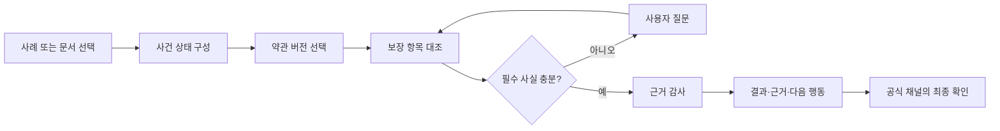

# 2026 금융 AI Challenge 기능명세서 — 보험금 길잡이 Agent

> 문서 상태: 예선 제출용 최신본
>
> 기준일: 2026-08-12
>
> 배포 URL: <https://finai26.turtlehwan.dev>
>
> 테스트 계정: 필요 없음
>
> 작성 원칙: 배포 URL에서 현재 재현되는 기능만 구현 범위로 기록한다.

## 1. MVP 구현 범위

### 1.1 구현 결과

본 MVP는 사용자가 비식별 합성 사례 또는 자신의 문서를 입력하면, 실제 LangGraph
상태 그래프가 다음 과정을 수행하고 그 실행 근거를 화면에 표시하는 웹서비스다.

1. 보험가입증서·진료자료에서 계약·치료 사실 추출
2. 상품코드·계약일과 공식 판매기간을 대조해 적용 약관 버전 선택
3. 확인된 사실과 가입 보장 조건 대조
4. 필수 사실 누락 시 질문하고 답변 뒤 사건 상태에서 재개
5. 정의·지급·제한·면책·청구서류 근거의 연결성 감사
6. 제한된 결과 상태와 필요 서류·보험회사 질문·공식 경로 생성
7. 실제 실행 trace와 근거 경로를 React Flow로 시각화

| 범위 | 현재 구현 |
| --- | --- |
| 공식 근거 | 우체국보험 2개 상품·3개 약관 버전의 판매기간·조항·쪽수·SHA-256 |
| 사례 데이터 | 비식별 합성 사례 4종과 합성 보험가입증서·진료자료 |
| 사용자 입력 | 텍스트 레이어 PDF·TXT 최대 2개, 동의 시 PDF·JPG·PNG·WEBP 변환 |
| Agent 실행 | LangGraph의 Agent·Tool·Gate·Human Review 조건부 실행 |
| 생성형 AI | 동의 기반 문서 변환과 마스킹된 누락 사실 후보·질문 생성 |
| 결과 | `확인 권장`·`정보 필요`·`가능성 낮음`·`확인 불가`, 근거·서류·공식 경로 |
| 평가 | 합성 회귀 50건과 분리 수작업 합성 점검 15건의 계약 지표 공개 |

### 1.2 미구현·제외 범위

- 보험금 지급 여부·예상 금액·기존 청구 이력의 확정
- 보험회사 지급심사·손해사정·청구 대행·상품 추천
- 실사용자 보험·진료·지급 이력을 이용한 모델 학습 또는 성능 평가
- 임베딩 검색·Hybrid RAG·범용 LLM 기반 약관 검색
- 민간 보험사 전체 상품 또는 우체국보험 전체 상품 지원
- 저해상도·손상 문서·복잡한 표에 대한 OCR 정확성 보장
- 승인 즉시 운영 약관 인덱스를 자동 변경하는 무인 PolicyOps

## 2. 주요 기능 목록

### 2.1 사건 확인 기능

| 기능명 | 실제 동작 | 관련 화면 | 구현 상태 |
| --- | --- | --- | --- |
| 합성 사례 선택 | 손목 골절·구버전·입원수술·면책 함정 사례를 불러옴 | 사례 선택 | 완료 |
| 사용자 문서 입력 | PDF·TXT의 텍스트를 추출하고 계약·진료 사실을 구조화 | 내 문서로 확인 | 완료 |
| 동의형 AI 문서 변환 | 명시 동의 시 PDF·JPG·PNG·WEBP를 Workers AI로 텍스트화 | 내 문서로 확인 | 완료 |
| 개인정보 마스킹 | 주민등록번호·전화번호·증권번호·이름 표기를 결과 전 마스킹 | 문서 확인 | 완료 |
| 사건 상태 구성 | 상품코드·계약일·보장명·진단코드·입원·수술 사실을 LangGraph 상태에 기록 | 분석 과정 | 완료 |

### 2.2 근거 확인 기능

| 기능명 | 실제 동작 | 관련 화면 | 구현 상태 |
| --- | --- | --- | --- |
| 약관 버전 선택 | 상품코드·계약일과 공식 판매기간을 대조하고 불일치 시 중단 | 분석 과정·결과 | 완료 |
| 보장 항목 대조 | 확인된 계약·치료 사실을 지원 사례의 보장 조건과 대조 | 분석 과정·결과 | 완료 |
| 관계 근거 확장 | 정의·지급·제한·면책·청구서류 근거를 결정론적으로 함께 연결 | 근거 약관 | 완료 |
| 근거 감사 | 공식 출처·버전·조항·쪽수·필수 근거 유형을 검사 | 근거 약관·분석 과정 | 완료 |
| 근거 지도 | 사건 → 진단 → 보장 항목 → 약관 → 다음 행동을 React Flow로 표시 | Claim Evidence Map | 완료 |

### 2.3 사람 중심 실행 기능

| 기능명 | 실제 동작 | 관련 화면 | 구현 상태 |
| --- | --- | --- | --- |
| Human-in-the-loop | 수술·입원·기존 청구 등 필수 사실이 없으면 질문 후 재개 | 정보 확인 | 완료 |
| 제한 결과 상태 | 네 상태와 이유·미확인 조건을 함께 표시 | 분석 결과 | 완료 |
| Action Pack | 필요 서류, 보험회사에 물어볼 질문, 공식 경로를 정리 | 다음 행동 | 완료 |
| Agent 실행 캔버스 | 실제 trace의 노드 역할·입력·출력·상태·소요시간을 표시 | 분석 과정 | 완료 |
| 글·음성 요청 | 텍스트 또는 지원 브라우저의 Web Speech API 요청을 화면 이동·제한 답변으로 해석 | 정보 확인·결과 | 완료 |
| 큰글씨·반응형 | 최소 14px 글자, 큰글씨 설정 저장, 320px 이상 화면 재배치 | 전체 | 완료 |

### 2.4 검증·운영 기능

| 기능명 | 실제 동작 | 관련 화면 | 구현 상태 |
| --- | --- | --- | --- |
| 합성 회귀 평가 | 고정 fixture 50건의 버전·근거·안전 중단·trace 계약 검사 | 내부 평가 | 완료 |
| 분리 수작업 합성 점검 | 회귀 생성 규칙과 분리한 합성 사건 15건의 같은 계약 검사 | 내부 평가 | 완료 |
| 평가 한계 고지 | 실제 지급 정확도·실사용자 분포를 대표하지 않음을 상시 표시 | 내부 평가 | 완료 |
| PolicyOps 검토 시연 | 공식 문서의 버전·해시·조항 변경과 승인 상태를 시연 | PolicyOps | 완료 |

## 3. 사용자 이용 흐름

### 3.1 기본 심사 흐름

1. 사용자가 배포 URL에 접속한다.
2. `손목 골절` 합성 사례를 선택하고 `이 사례 분석하기`를 누른다.
3. Case Analyst → Document Tool → Version Resolver → Coverage Matcher의 실제
   실행 상태를 확인한다.
4. `수술 여부` 질문에 답한다. 답변 전에는 결과를 확정하지 않는다.
5. 답변을 반영해 Evidence Auditor와 Action Planner가 실행된다.
6. 보장 항목별 상태·이유·미확인 조건을 확인한다.
7. 근거 약관에서 공식 URL·버전·조항·PDF 쪽수·SHA-256을 확인한다.
8. Action Pack에서 서류·보험회사 질문·공식 경로를 확인한다.
9. 보험회사 또는 공식 조회·청구 채널에서 사용자가 직접 최종 확인한다.

### 3.2 사용자 문서 흐름

1. `내 문서로 확인하기`를 연다.
2. 텍스트 레이어 PDF·TXT를 최대 2개 넣거나 공식 약관 연결 샘플을 불러온다.
3. 이미지·스캔 PDF는 `AI 보조 문서 이해`를 켜고 외부 처리 고지에 동의한다.
4. 마스킹된 추출 결과에서 상품코드·계약일·보장명·진단코드를 확인한다.
5. 준비 사례와 동일한 LangGraph 근거 확인 흐름을 실행한다.
6. 지원 범위를 벗어나거나 근거가 부족하면 `확인 불가`와 공식 문의 경로를 받는다.

## 4. AI 및 데이터 처리 방식

### 4.1 실행 책임 계약

| 구성요소 | 입력 | 출력 | 금지된 권한 | 실패 시 동작 |
| --- | --- | --- | --- | --- |
| Workers AI 문서 변환 | 동의한 PDF·이미지 원본 | 변환 텍스트 | 보험 사실·보장 상태 판단 | 변환 실패 고지, 텍스트 입력 안내 |
| Workers AI 누락 사실 도구 | 서버가 재마스킹한 미리보기 | 누락 후보·짧은 질문 JSON | 약관·버전·인용·금액 생성 | 결정론적 질문 또는 수동 입력으로 대체 |
| LangGraph | 사건 상태·노드 결과 | 실행 순서·분기·중단·재개 trace | 보험회사 최종 판단 | 오류 노드와 중단 이유 반환 |
| Version Resolver Tool | 상품코드·계약일·판매기간 | 적용 약관 버전 | 유사도 기반 추정 | `확인 불가` |
| 관계 근거 그래프 | 적용 버전·보장 항목 | 정의·지급·제한·면책·서류 근거 | 범용 문장 생성 | 필수 관계 누락 시 감사 실패 |
| Evidence Auditor Agent | 버전·근거 묶음·공식 메타데이터 | 통과 여부·실패 사유 | 법률·의학적 의미의 최종 해석 | `확인 불가` |
| Action Planner Agent | 감사 통과 결과 | 상태·서류·질문·공식 경로 | 지급 확정·청구 대행 | 안전 상태와 공식 문의만 제공 |

현재 런타임의 생성형 AI는 `@cf/meta/llama-3.1-8b-instruct-fast` JSON Mode와
Cloudflare Workers AI Markdown Conversion에 한정된다. 보험약관 선택·조항 인용·
상태 판정은 LLM이 아니라 코드의 결정론적 경로가 처리한다.

### 4.2 입력·중간·출력 데이터

| 단계 | 데이터 | 공개·저장 경계 |
| --- | --- | --- |
| 공식 지식 | 우체국보험 2개 상품·3개 약관 버전, 표준약관, 공식 서류 기준 | URL·판매기간·쪽수·해시 공개 |
| 데모 입력 | 비식별 합성 보험가입증서·진료자료·사건 사실 | 실제 개인·청구·지급 이력 미사용 |
| 사용자 입력 | PDF·TXT, 동의 시 PDF·JPG·PNG·WEBP, 추가 질문 답변 | 원본을 서비스 DB·파일시스템·모델 학습에 저장하지 않음 |
| 중간 상태 | 마스킹된 미리보기, 계약·치료 사실, 적용 버전, 실행 trace | 응답 생성 범위에서 처리 |
| 최종 출력 | 제한 상태·이유·근거·미확인 조건·서류·공식 경로 | 지급 여부·확정 금액 제외 |

### 4.3 개인정보·민감정보

- 회원가입과 실제 개인 데이터 입력은 심사 흐름에 필요하지 않다.
- 기본 파싱 결과에서 주민등록번호·전화번호·증권번호·이름 표기를 마스킹한다.
- AI 보조를 켜면 원본 PDF·이미지가 Cloudflare Workers AI 변환 서비스에
  전송됨을 토글 옆에서 고지하고 명시 동의를 받는다.
- 일반 LLM 도구에는 원본이 아닌 서버 측 재마스킹 미리보기만 전달한다.
- 문서 원본을 서비스 파일시스템·데이터베이스·모델 학습에 저장하지 않는다.
- 음성 입력은 사용자가 마이크를 누른 경우에만 시작하며, 브라우저 제공자의
  외부 인식 서비스 전송 가능성과 서비스 서버의 원음성 비저장을 고지한다.

### 4.4 평가 데이터와 해석

| 평가 묶음 | 사례 | 현재 계약 결과 | 의미 |
| --- | --- | --- | --- |
| 결정론적 회귀 | 50건: 지원 36·미지원/누락 14 | 네 계약 지표 통과 | 코드 변경 시 버전·근거·안전 동작 회귀 확인 |
| 분리 수작업 합성 점검 | 15건: 지원 8·미지원 7 | 네 계약 지표 통과 | 생성 규칙과 분리한 작은 합성 스모크 점검 |

네 계약 지표는 `버전 선택`, `근거 완전성`, `안전 중단`, `trace 무결성`이다.
실제 보험금 지급 정확도, OCR 정확도, 법률·의학적 판단 정확도를 의미하지 않는다.

## 5. MVP 검증 방법

### 5.1 90초 핵심 검증

| 시간 | 심사자 행동 | 확인할 증거 | 예상 결과 |
| --- | --- | --- | --- |
| 0~15초 | `손목 골절` 사례 선택·분석 | 실제 Agent 실행 캔버스 | Human Review에서 수술 여부 질문 대기 |
| 15~30초 | `수술은 안 했어요` 선택 | 상태 재개·Evidence Auditor 실행 | 재해골절보험금 `확인 권장`, 수술·입원 관련 `가능성 낮음` |
| 30~50초 | 근거 약관 열기 | P400073 / 2504, 조항·쪽수·SHA, 정의·지급·제한·면책·서류 | 단일 지급 문장이 아닌 근거 묶음 표시 |
| 50~65초 | Action Pack 열기 | 필요 서류·보험회사 질문·공식 경로 | 지급 확정 없이 다음 행동 제공 |
| 65~90초 | `면책 함정`에서 `잘 모르겠어요` 선택 | 누락 사실·안전 중단 | `정보 필요` 또는 `확인 불가`, 지급 단정 없음 |

### 5.2 확장 검증

| 검증 항목 | 절차 | 예상 결과 |
| --- | --- | --- |
| 구버전 선택 | P400051 계약일 사례 실행 | 같은 골절 사건이 2112 약관 근거로 전환 |
| 입원·수술 구분 | P600107 5일 입원 사례 실행 | 4일 이상 입원 요건과 수술기록 필요를 구분 |
| 사용자 문서 | 공식 약관 연결 샘플 또는 합성 PDF/TXT 입력 | 구조화 결과와 같은 그래프 실행 |
| AI 외부 처리 | AI 보조를 켜고 합성 PDF·이미지 입력 | 동의 고지 후 변환 또는 안전한 실패 안내 |
| 평가 공개 | 내부 평가 보기 | 50건·15건을 분리하고 실제 지급 정확도가 아님을 고지 |
| 반응형 | 320·390·768·1024·1440px 확인 | 가로 넘침 없이 재배치, 최소 14px 글자 유지 |
| 접근성 | 키보드 이동·큰글씨·reduced-motion 확인 | 주 행동과 상태 변화가 텍스트로도 전달 |

### 5.3 실행 환경

- 배포 URL: <https://finai26.turtlehwan.dev>
- 테스트 계정: 필요 없음
- 권장 브라우저: 최신 Chrome, Safari, Edge
- 권장 화면: 가로 320px 이상, JavaScript 활성화
- 음성 입력: 브라우저가 Web Speech API를 지원할 때만 보조 제공

### 5.4 MVP 제한사항

- 공식 근거 범위는 우체국보험 2개 상품·3개 버전이다.
- 보험가입증서·진료자료·평가 사건은 비식별 합성 데이터다.
- AI 보조를 끄면 텍스트 레이어 PDF·TXT만 지원한다.
- AI 문서 변환은 저해상도·손상 문서·복잡한 표에서 실패할 수 있다.
- 50건·15건 평가는 합성 사건의 실행 계약 검사이며 실제 지급 정확도가 아니다.
- 인용 검증은 출처·버전·쪽수·필수 근거 유형의 존재를 확인하며, 법률·의학적
  의미의 최종 정확성을 보장하지 않는다.
- PolicyOps 승인은 시연 상태만 기록하며 운영 약관 인덱스를 자동 변경하지 않는다.
- 보험회사의 청구 이력·지급심사·확정 금액을 조회하지 않는다.
- 실제 보험금 지급 여부는 보험회사가 결정한다.

## 6. 실제 데이터·기술 출처

- [공공데이터포털, 우체국보험 상품별 약관 정보](https://www.data.go.kr/data/15111699/openapi.do)
- [우체국보험 공시실](https://www.epostlife.go.kr/ISB.RetrieveDisclosureDetailList.ins)
- [국가법령정보센터, 보험업감독업무시행세칙](https://www.law.go.kr/LSW/admRulInfoP.do?admRulSeq=2200000108867&chrClsCd=010202)
- [손해보험협회 소비자포털, 보험금 청구서류 안내](https://consumer.knia.or.kr/m/consumer/insurance-guide/0202.do)
- [Cloudflare Workers AI JSON Mode](https://developers.cloudflare.com/workers-ai/features/json-mode/)
- [Cloudflare Workers AI Markdown Conversion](https://developers.cloudflare.com/workers-ai/features/markdown-conversion/usage/binding/)
