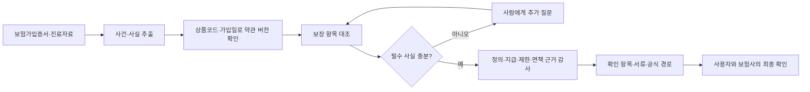

# 2026 금융 AI Challenge 기획서 — 보험금 길잡이 Agent

> 문서 상태: 예선 제출용 최신본
> 기준일: 2026-08-09
> 원칙: 이 문서는 현재 기획의 단일 최신본이다. 구현 범위는
> [기능명세서](./feature-specification.md)와 일치시킨다.
> 시각 자료: [제출 문서용 시각 자료](./submission-visuals.md)와
> [`output/pdf/`의 기획서 PDF 초안](../output/pdf/2026-finance-ai-challenge-proposal-draft.pdf)을
> 같은 기준으로 유지한다.
> 각 주장과 설계 선택의 근거 등급은 [주장·의사결정 근거 대장](./claim-evidence-matrix.md)에서 확인한다.

## 1. 서비스 명칭

**보험금 길잡이 Agent**

고령 부모의 보험을 대신 챙기는 가족을 위한 약관 근거 기반 보험금
확인·행동 Agent

| 요약 항목 | 현재 기획·MVP 기준 |
| --- | --- |
| 핵심 사용자·채널 | 고령 부모의 보험을 함께 챙기는 가족 보호자 · 모바일/데스크톱 웹 |
| 해결 과업 | 보험가입증서·진료자료와 가입 당시 적용된 보험약관을 대조해, 사용자가 확인할 보장 항목과 다음 행동을 정리 |
| 실제성 | 우체국보험 2개 상품·3개 약관 버전, 공식 판매기간·조항·쪽수·해시를 결과에 연결 |
| AI 역할 | 명시 동의 시 문서 변환과 마스킹된 누락 사실 후보만 보조. 버전·인용·보장 상태·금액은 결정론적 경로가 처리 |
| 역할 경계 | 최종 지급 판단·청구 대행·손해사정·상품 권유는 하지 않으며, 사용자가 보험사 공식 채널에서 최종 확인 |

## 2. 아이디어 기획 핵심내용

> **보험금 확인의 어려움은 ‘조회 버튼’이 아니라, 내 문서·치료 사실·가입 당시
> 보험약관을 대조해 무엇을 확인할지 정리하는 데서 발생한다.**

| 핵심 설계 | Agent가 실제로 하는 일 | 심사자가 확인할 증거 |
| --- | --- | --- |
| 사건 기반 확인 | 보험가입증서·진료자료·사고 설명을 연결해 확인할 보장 항목을 선별 | 준비된 사례 또는 사용자 문서를 실행하면 사건·진단·보장 항목이 구조화됨 |
| 가입일 기준 약관 | 상품코드·계약일로 가입 당시 적용된 실제 보험약관 버전을 선택 | 준비 사례와 평가 fixture에서 서로 다른 판매기간·버전·쪽수 표시 |
| 반대 근거 동시 검토 | 정의·지급·제한·면책을 결정론적 관계 그래프로 함께 확장 | 결과의 근거 경로와 조항 원문·면책 동반 표시 |
| 멈추고 묻는 흐름 | 수술·입원·기존 청구처럼 부족한 사실을 질문하고, 답변 뒤 같은 사건 상태에서 재개 | `정보 필요` 질문과 답변 전후 결과 변화 |
| 사람 중심 실행 | 근거·필요 서류·공식 경로를 제공하고 최종 판단은 사람과 보험사가 수행 | 내보험찾아줌·실손24·보험사 공식 채널 안내 및 역할 경계 고지 |

## 3. 문제 정의 및 제안 배경

### 3.1 해결할 문제

보험금 미청구는 단순히 “조회 채널이 없어서”만 발생하지 않는다. 금융위원회는
숨은보험금이 발생하는 주요 원인으로 보험금 발생 사실을 알지 못하거나 이자
조건을 오해하는 경우를 들었다. 2026년 7월 발표 기준 찾아가야 할 숨은보험금은
10.3조 원이며, 2025년에만 약 80만 건·3조 2,470억 원이 환급됐다.

보험연구원 조사에서도 보험금 청구 과정의 불편은 반복된다.

- 보험금 청구 절차가 불편하다는 응답: 단일응답 39.7%, 복수응답 52.5%
- 보험금 지급 과정 안내가 부족하다는 응답: 54.7%
- 보험금 지급 내역 안내가 부족하다는 응답: 51.4%

위 통계는 [금융위원회 숨은보험금 보도자료](https://www.fsc.go.kr/po010103/87270)와
[보험연구원 보험소비자 행태조사 본문](https://www.kiri.or.kr/pdf/%EC%A0%84%EB%AC%B8%EC%9E%90%EB%A3%8C/nre2022-17.pdf)에
근거한다. 금융위원회 수치는 2026년 7월 발표 기준이며, 보험연구원 수치는 조사
문항의 단일·복수응답 구분을 유지해 인용했다.

현재 서비스는 계약 조회, 숨은보험금 조회, 실손 청구처럼 이미 확인된
대상을 실행하는 데 강하다. 반면 사용자가 여러 보험계약의 보장 내용과 치료 사실을 대조해
“무엇을 확인해야 하는지” 찾고, 가입 당시 약관의 예외 조건까지 검토하는
작업은 여전히 어렵다.

| 관찰된 불편 | 확인 근거 | 서비스가 줄이는 공백 |
| --- | --- | --- |
| 지급 사유나 보장 항목의 존재를 알기 어려움 | 금융위원회는 숨은보험금 발생 원인으로 보험금 발생 사실을 알지 못하는 경우를 제시 | 사건·진단·보장 항목을 먼저 연결해 ‘확인할 항목’부터 좁힘 |
| 절차·지급 안내를 따라가기 어려움 | 보험연구원 조사: 청구 절차 불편 39.7%(단일)/52.5%(복수), 지급 과정 안내 부족 54.7% | 조항 근거, 미확인 조건, 서류, 공식 경로를 한 결과에 배치 |
| 최신 문서로 과거 계약을 잘못 이해할 위험 | 보험계약마다 상품코드·계약일·판매기간이 다름 | 계약일과 판매기간을 먼저 대조하고 일치하지 않으면 `확인 불가`로 중단 |

### 3.2 핵심 고객과 채널

1차 고객은 **고령 부모의 보험을 대신 챙기는 가족 보호자**다. 고령층의
디지털 접근성 문제를 고려하되, 문서 촬영·업로드와 가족 간 확인, 공식 채널
실행을 현실적으로 수행할 수 있는 가족을 모바일·데스크톱 웹의 주 사용자로
설정한다.

이 서비스는 기존 공식 채널과 경쟁하지 않는다. 공식 조회·청구 전에 사용자가
확인할 보장 항목과 준비할 자료를 정리하는 **사전 확인 채널**이며, 마지막 단계에서
내보험찾아줌·실손24·보험사 공식 채널로 연결한다.

## 4. 서비스 컨셉 및 차별성

### 4.1 서비스 컨셉

> 보험은 사람이 결정하고, Agent는 놓치지 않게 돕습니다.

보험금 길잡이 Agent는 질문에 한 번 답하는 약관 챗봇이 아니다. 사용자의
보험사건을 목표로 받아 문서를 구조화하고, 정확한 약관 버전과 근거를 찾고,
부족한 사실을 질문하고, 검증된 다음 행동까지 준비하는 **Agentic 금융
업무 흐름**이다.

사용자에게는 자녀가 옆에서 서류를 함께 보는 것처럼 차분한 개인 비서로
다가간다. 긴 채팅 기록을 쌓는 대신 글이나 음성으로 지금 궁금한 것을 말하면
결과 요약, 근거 약관, 준비 서류, Agent 실행 과정 가운데 필요한 컴포넌트만
화면 전면으로 가져온다. 나머지는 짧은 보기 버튼으로 물러나 한 화면에서 읽을
내용을 줄인다.

### 4.2 차별성 비교

| 비교 기준 | 개별 조회·청구 서비스 | 일반 약관 질의응답 | 보험금 길잡이 Agent |
| --- | --- | --- | --- |
| 시작점 | 이미 알고 있는 계약·청구 건 | 사용자의 질문 | 보험사건과 문서 묶음 |
| 약관 선택 | 최신 안내 또는 사용자가 직접 확인 | 검색 결과 중심 | 상품코드·계약일·판매기간으로 버전 먼저 확정 |
| 근거 범위 | 절차 또는 단일 항목 | 관련 문장 중심 | 정의·지급·제한·면책을 관계로 함께 확인 |
| 정보 부족 시 | 별도 문의 또는 재입력 | 일반 답변 지속 가능 | 부족한 사실을 질문하거나 `확인 불가`로 안전 중단 |
| 결과 | 조회·청구 화면 | 답변 텍스트 | 근거 경로, 미확인 조건, 서류, 공식 실행 경로 |

### 4.3 사용자에게 보이는 실행 흐름

그림 1. `사건 → 근거 → 사람의 실행`으로 이어지는 Agentic 확인 흐름. 화면의
LangFlow형 실행 캔버스는 실제 LangGraph trace가 발생한 노드만 활성화한다.

### 4.4 Agent 구성

- **Case Analyst Agent**: 사용자 목표와 사고·진단·기존 청구 여부 구조화,
  다음 도구 선택, 누락 정보 질문. 사용자가 동의한 경우 Workers AI의 마스킹된
  문서 요약을 보조 입력으로 받되, 보장 상태나 근거 인용을 만들 권한은 없다.
- **Coverage Matcher Agent**: 가입 특약·진단코드·입원일수를 확인된 약관 버전의
  보장 항목과 대조한다. 연결이 성립하지 않으면 `정보 필요`로 표시한다.
- **Evidence Auditor Agent**: 잘못된 버전, 인용 오류, 면책 누락, 근거 없는
  단정을 탐지한다.
- **Action Planner Agent**: 감사를 통과한 근거로 보장 항목별 상태·필요 서류·
  확인 질문을 만들고, 감사에 실패하면 `확인 불가`로 안전 종료한다.
- **결정론적 도구·확인 단계**: Document Tool, Version Resolver, 조항 관계 그래프,
  Information Gate가 Agent 사이의 입력과 분기를 제한한다. 인용문 존재 검사,
  개인정보 마스킹, 출력 스키마 검증은 Agent가 아니라 결정론적 검사 항목이다.

## 5. 활용 데이터 및 생성형 AI 모델 적용 방안

### 5.1 현재 결과에 연결한 실제 데이터

- 우정사업본부 공공데이터포털 `우체국보험 상품별 약관 정보조회 API`
- 우체국보험 공시실의 상품코드·판매기간·공식 약관 PDF
- 국가법령정보센터 보험 표준약관
- 금융감독원 `보험업감독업무시행세칙 별표 15` 현행본(2026-07-15 시행)의
  질병·상해보험 제2·3·4·5·7·8조 구조화 구간
- 손해보험협회 소비자포털의 표준 청구서류 안내(공식 행동 경로 기준)

현재 런타임에는 연결하지 않았지만, 다음 공공데이터는 상품군과 사건 유형을
확대할 때 사용할 **확장 후보**로 구분한다.

- 우정사업본부 공공데이터포털 `우체국보험 상품별 보장내용 정보조회 API`
- 건강보험심사평가원 질병정보·수가기준 공공데이터
- 보험사·공공기관의 공식 청구 구비서류와 공식 실행 경로

예선 MVP가 결과 근거로 직접 연결하는 공식 상품 약관은 다음 2개 상품·3개 버전이다.

| 상품·버전 | 상품코드 | 공식 판매기간 | MVP 검증 범위 |
|---|---|---|---|
| 무배당 우체국와이드건강보험 2112 | P400051~P400054 | 2021-12-01~2025-04-02 | 업로드·평가 경로의 S52 골절 특약 |
| 무배당 우체국와이드건강보험 2504 | P400073~P400076 | 2025-04-03~2025-06-04 | 준비 사례·업로드·평가 경로의 S52 골절 특약 |
| 무배당 우체국온라인입원수술보험 2112 | P600107 | 2021-12-01~2025-04-02 | 5일 입원 준비 사례·업로드·평가 경로 |

합성 보험가입증서와 진료문서는 위 상품코드·계약일·가입 보장·진단/입원 사실만
재현한다. 예를 들어 2504 골절 사례는 지급 사유·골절 정의·동일 사고 제한·면책·
청구 서류·분류표를, 온라인입원수술보험은 4일 이상 입원 요건·입원/수술 정의·
제한·면책·입원확인서/수술증명서 요건을 실제 원문에서 연결한다.

### 5.2 사용자 데이터

- 사용자가 업로드한 텍스트 레이어 PDF·TXT 보험가입증서·진료자료
- 사용자가 명시적으로 AI 보조에 동의한 경우의 PDF·JPG·PNG·WEBP 문서 변환
- 사고일, 수술·입원 여부, 기존 청구 여부에 대한 사용자 답변
- 심사용 비식별 합성 보험증권·진료문서

서비스는 원본을 자체 파일시스템·데이터베이스에 저장하거나 모델 학습에 사용하지
않는다. 주민등록번호·증권번호 등 직접 식별정보는 기본 파싱 결과에서 마스킹하고
구조화된 사건 정보만 LangGraph 상태에 전달한다. 다만 AI 보조 문서 변환을 켜면
원본이 Cloudflare Workers AI 변환 서비스에 전송되므로, 이 외부 처리와 범위를
화면에서 명시적으로 고지하고 동의를 받는다. 일반 LLM 도구에는 원문이 아닌
마스킹된 미리보기만 전달한다.

### 5.3 생성형 AI와 Agentic Workflow

생성형 AI는 사용자가 동의한 경우에만 두 가지 제한된 역할을 수행한다.

1. **AI 문서 변환**: Cloudflare Workers AI Markdown Conversion이 PDF·이미지를
   텍스트로 변환한다.
2. **마스킹된 문서 사실 보조**: Cloudflare Workers AI
   `@cf/meta/llama-3.1-8b-instruct-fast`의 JSON Mode가 누락 사실 후보와 짧은
   확인 질문만 반환한다.

범용 LLM에게 보험금 판단, 약관 검색, 임베딩 검색, Hybrid RAG, 지급액 계산을
맡기지 않는다. Agent 실행 상태와 조건부 경로는 LangGraph가 관리하고, 실제
적용 약관의 조항 ID·버전·관계는 코드의 결정론적 그래프가 선택한다. 최종 출력은
공식 URL·쪽수·조항 존재·필수 면책 동반 여부를 검사하는 Evidence Auditor를
통과해야 하며, 모델 응답만으로 상태나 인용을 생성할 수 없다. AI 호출이 실패해도
텍스트 파싱·버전 선택·근거 연결·안전 중단은 결정론적 경로로 재현된다.

`자가 개선`은 모델이 지급 규칙을 임의로 학습한다는 뜻이 아니다. 신규 공식
문서를 감지하면 문서 해시·시행일·조항을 비교하고, 변경된 근거로 내부 회귀
테스트를 생성한 뒤 사람 승인을 거쳐 별도 배포에서 반영하는 PolicyOps 방식이다.
현재 예선 데모의 회귀 수치 100%는 실제 지급 정확도가 아니라 50건 고정 fixture의
계약·안전성 통과율이다. 이와 별도로 생성 규칙과 분리한 15건 수작업 라벨 holdout을
버전 선택·근거 완전성·면책 회수·안전 중단에 사용한다. 두 집합 모두 합성
사실관계이므로 실제 고객 분포나 보험사 지급 이력을 대표하지 않는다.

자연어 비서 입력은 화면 전환과 추가 질문의 제한된 답변 값으로 해석한다.
지원 브라우저에서는 Web Speech API를 보조 입력으로 사용하지만 브라우저별
지원 차이와 외부 인식 서비스 전송 가능성은 사용자가 마이크를 켠 순간에
고지한다. 음성 원본을 서비스 서버에 저장하지 않고, 음성이 없어도 텍스트와
빠른 요청으로 같은 흐름을 완료할 수 있다.

| 데이터·처리 구간 | 사용 목적 | 저장·외부 처리 경계 |
| --- | --- | --- |
| 공식 상품 약관·표준약관·공공 의료코드 | 버전 선택, 근거 조항·서류 기준 확인 | 출처 URL·시행/판매기간·페이지·해시를 provenance로 공개 |
| 비식별 합성 보험가입증서·진료자료 | 심사 시연과 50건 회귀·15건 holdout | 실제 개인·청구·지급 이력 미사용 |
| 사용자가 입력한 텍스트 레이어 PDF·TXT | 문서 사실 추출 | 원본을 서비스 파일시스템·DB·모델 학습에 저장하지 않음 |
| 동의한 PDF·JPG·PNG·WEBP | Workers AI 문서 변환 | 외부 Cloudflare Workers AI에 전송됨을 사전 고지, 변환 결과만 브라우저로 반환 |
| 마스킹된 미리보기 | 누락 사실 후보·짧은 질문 생성 | 서버 측 재마스킹 후 LLM에 전달, 지급·약관·금액 판단 금지 |

## 6. 기대 효과 및 확장 가능성

### 6.1 고객 효과

- 여러 보험계약과 치료 정보 사이에서 놓친 확인 대상을 빠르게 좁힌다.
- 보험사 문의 전에 근거 조항, 미확인 조건, 필요한 서류를 한 번에 준비한다.
- 지급 가능성을 단정하는 잘못된 기대 대신 확인 가능한 사실과 한계를
  구분한다.
- 17px 본문·큰글씨·단계별 한 개의 주 행동, 그리고 요청에 따라 현재 컴포넌트만
  크게 보여주는 적응형 화면으로 디지털 접근 부담을 낮춘다.

| 수혜자 | 즉시 얻는 변화 | 검증·한계 |
| --- | --- | --- |
| 가족 보호자 | 여러 문서에서 확인할 보장 항목·근거·서류를 한 번에 정리 | 지급 여부·금액·기존 청구 이력은 확정하지 않음 |
| 보험회사·상담 채널 | 상품·약관·미확인 조건이 정리된 문의로 연결 | 보험사 시스템과 청구 심사를 대체하지 않음 |
| 심사자·운영자 | 실데이터 출처, Agent trace, 안전 중단, 평가 범위를 URL에서 재현 | 근거 상품군은 2개 상품·3개 버전으로 제한 |

### 6.2 금융회사와 사회적 효과

- 근거 없는 반복 문의보다 상품·조항·질문이 구조화된 상담 전환을 돕는다.
- 약관 버전과 면책 근거를 함께 제시해 설명 가능성과 소비자 신뢰를 높인다.
- 미청구 가능성의 사전 발견을 도와 포용금융과 금융소비자 권익에 기여한다.

### 6.3 확장

- 우체국보험에서 민간 생명·손해보험 공시약관으로 상품군 확대
- 골절·입원·수술에서 진단·후유장해·중도보험금 등 사건 유형 확대
- 신규 약관 감지 → 조항 Diff → 회귀 평가 → 사람 승인 후 반영하는
  PolicyOps 운영 도구
- 금융상품 설명서, 연금·대출 약정, 공공 복지 수급 조건 등 버전과 예외가
  중요한 다른 문서형 의사결정 지원으로 확장

## 7. 안전성과 검증 가능성을 기능으로 만든 Agent

서비스는 아래 네 상태만 사용한다.

| 결과 상태 | 사용 조건 | 사용자에게 주는 다음 행동 |
| --- | --- | --- |
| `확인 권장` | 보험가입증서·사건·보험약관 근거가 연결됐으나 보험사 최종 확인이 필요 | 근거 조항·서류·공식 채널 확인 |
| `정보 필요` | 수술·입원·기존 청구 등 핵심 사실이 없음 | Agent 질문에 답변하거나 공식 자료 확인 |
| `가능성 낮음` | 현재 입력에서 필요한 조건이 확인되지 않음 | 해당 조건이 적힌 자료가 있는지 재확인 |
| `확인 불가` | 버전·근거·면책 검증 실패 또는 보험사 내부 데이터 필요 | 보험사·공식 채널에 직접 확인 |

심사자는 배포 URL에서 샘플 사건을 실행한 뒤 실제 상품코드, 적용 약관 버전,
원문 출처, Agent별 입력·출력, 근거 그래프, 질문에 따른 분기, Action Pack을
직접 확인할 수 있다. 사용자가 자신의 텍스트 레이어 PDF 또는 TXT를 넣어도
동일한 파이프라인이 작동하며, AI 보조에 동의하면 이미지·스캔 자료도 별도
AI 문서 변환 단계를 거쳐 같은 결정론적 근거 검증으로 연결된다.

## 출처

상품 약관과 표준약관은 출처·적용일·쪽수·문서 해시를 함께 관리한다. P400051·
P400073 상품 약관과 표준약관은 2026-07-31, P600107 상품 약관은
2026-08-05에 확인했다.

- [2026 금융 AI Challenge 대회 페이지](https://daker.ai/public/hackathons/2026-finance-ai-challenge)
- [금융보안원 대회 공고](https://www.fsec.or.kr/bbs/detail?bbsNo=11997&menuNo=66)
- [금융위원회, 숨은보험금 10.3조 원 안내](https://www.fsc.go.kr/po010103/87270)
- [보험연구원, 보험소비자 행태조사 본문](https://www.kiri.or.kr/pdf/%EC%A0%84%EB%AC%B8%EC%9E%90%EB%A3%8C/nre2022-17.pdf)
- [공공데이터포털, 우체국보험 상품별 약관 정보](https://www.data.go.kr/data/15111699/openapi.do)
- [공공데이터포털, 우체국보험 상품별 보장내용](https://www.data.go.kr/data/15111725/openapi.do)
- [우체국보험 판매중지 상품 공시](https://epostlife.go.kr/ASISDM00BT.do)
- [무배당 우체국와이드건강보험 2112 공식 약관 PDF](https://www.epostlife.go.kr/resources/js/biz/ip/gs/pdf/40190.pdf)
- [무배당 우체국와이드건강보험 2504 공식 약관 PDF](https://www.epostlife.go.kr/resources/js/biz/ip/gs/pdf/YAK_P400073_202504.pdf)
- [무배당 우체국온라인입원수술보험 2112 공식 약관 PDF](https://epostlife.go.kr/resources/js/biz/ip/gs/pdf/60440.pdf)
- [금융감독원·국가법령정보센터, 보험업감독업무시행세칙](https://www.law.go.kr/LSW/admRulInfoP.do?admRulSeq=2200000108867&chrClsCd=010202)
- [Cloudflare Workers AI JSON Mode](https://developers.cloudflare.com/workers-ai/features/json-mode/)
- [Cloudflare Workers AI Markdown Conversion](https://developers.cloudflare.com/workers-ai/features/markdown-conversion/usage/binding/)
- [국가법령정보센터, 표준약관 별표 15 PDF](https://www.law.go.kr/LSW/flDownload.do?flSeq=167076957&flNm=%5B별표+15%5D+표준약관%28제5-13조제1항관련%29&bylClsCd=200201)
- [손해보험협회 소비자포털, 실손의료보험금 청구서류 표준화·간소화](https://consumer.knia.or.kr/m/consumer/insurance-guide/0202.do)
