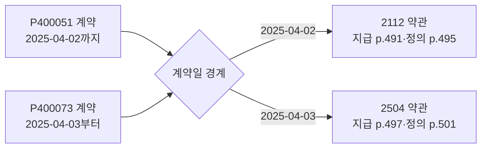
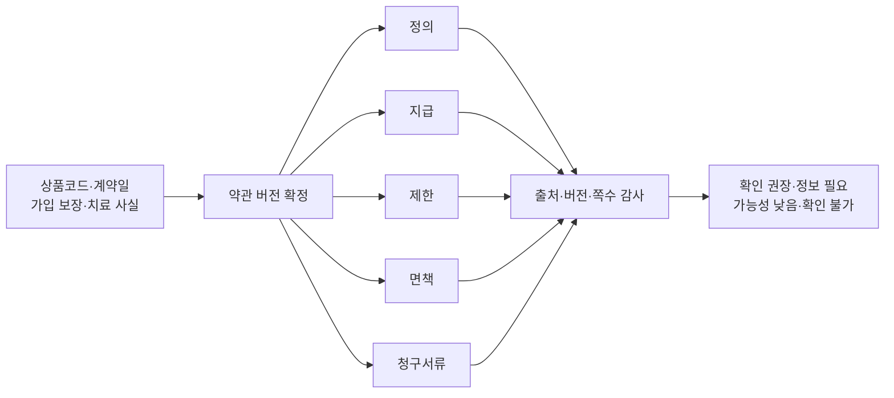
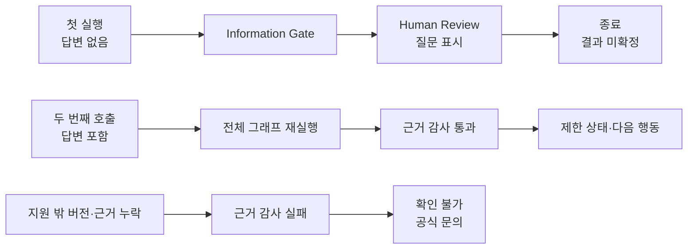

# 2026 금융 AI Challenge 기획서 — 보험금 길잡이 Agent

> 문서 상태: 예선 제출용 최신본
>
> 기준일: 2026-08-13
>
> 작성 기준: 공식 양식의 항목명·순서를 유지하고 관찰 사실(O), 제품 가설(H),
> 현재 구현(C), 시연·평가(S), 향후 계획(P)을 구분한다.

## 1. 서비스 명칭

**보험금 길잡이 Agent**

가입 당시 보험약관과 치료 사실을 대조해 **확인할 보장 항목·근거·다음 행동**을
정리하는 사람 중심 보험 확인 Agent

| 구분 | 제안 내용 |
| --- | --- |
| 핵심 사용자 | 고령 부모의 보험 확인을 돕는 가족 보호자 — 후속 사용자 조사로 검증할 1차 사용자 가설(H) |
| 입력 | 보험가입증서, 진료자료, 사고·치료 설명, 한 번의 확인 질문 답변 |
| 출력 | 확인할 보장 항목, 가입 당시 약관 조항·쪽수, 미확인 조건, 필요 서류, 공식 확인 경로 |
| 권한 경계 | 지급 여부·금액·기존 청구 여부를 확정하지 않으며 보험회사와 사용자가 최종 확인 |
| MVP 범위 | 우체국보험 2개 상품·3개 약관 버전, 비식별 합성 사례 4종, 실제 LangGraph 상태 그래프(C) |

## 2. 아이디어 기획 핵심내용

**보험금 길잡이 Agent는 “얼마를 받을 수 있는가”를 예측하지 않고, “가입 당시
계약에서 무엇을 어떤 근거로 확인할 것인가”를 준비한다.**

| 사용자가 멈추는 지점 | Agentic 처리 | 사용자가 받는 결과 | 배포 URL의 증거 |
| --- | --- | --- | --- |
| 계약일에 따라 적용 약관이 달라짐 | 상품코드·계약일·공식 판매기간 선대조 | 가입 당시 약관 버전 | 2025-04-02/04-03 경계 사례 |
| 치료 사실과 보장 조건이 여러 문서에 흩어짐 | 문서 사실을 사건 상태로 구조화하고 지원 범위와 대조 | 확인할 보장 항목 | 합성 사례·사용자 문서 흐름 |
| 지급 조항만 보면 제한·면책을 놓칠 수 있음 | 버전 확정 후 필수 근거 5유형 동반 조회 | 조항·쪽수·반대 근거가 포함된 근거 묶음 | Claim Evidence Map |
| 필수 사실이 없으면 결론이 달라짐 | 첫 실행을 질문 상태로 끝내고 답변 후 동일 사건 재실행 | 답변 전 `정보 필요`, 답변 후 제한 결과 | Human Review 분기 |
| 설명만으로 실제 행동이 어려움 | 근거 감사 결과를 서류·문의 질문·공식 경로로 변환 | 실행 가능한 확인 목록 | 다음 행동 카드 |

- **단순 챗봇 탈피(C)**: 문장 한 번을 생성하는 대신 사건 상태, 도구 실행,
  조건 분기, 사람 확인, 근거 감사를 순서대로 수행한다.
- **실제 데이터 연결(O+C)**: 공식 상품약관의 상품코드·판매기간·조항·쪽수·문서
  SHA-256을 결과에 연결한다.
- **제한형 생성 AI(C)**: 생성형 AI는 사용자가 동의한 문서 변환과 마스킹된
  누락 사실 후보·질문 생성에만 사용한다. 약관 버전·인용·상태는 코드가 결정한다.
- **재현 가능한 안전성(C+S)**: 심사자는 성공 결과뿐 아니라 질문 대기, 버전
  불일치, 근거 감사 실패와 안전 중단을 직접 확인할 수 있다.

## 3. 문제 정의 및 제안 배경

**문제는 공식 조회·청구 채널의 부재가 아니라, 사용자가 그 채널에 가기 전에
자신의 치료와 가입 계약에서 확인할 항목을 정리하기 어렵다는 데 있다.**

### 3.1 확인 공백

보험 소비자에게는 `지급 사실 미인지`와 `청구 전 확인 부담`이라는 서로 다른
문제가 있으며, 본 서비스는 후자를 직접 해결한다.

| 근거 상태 | 확인 내용 | 해석 경계 | 제품 설계 반영 |
| --- | --- | --- | --- |
| 공식 발표(O) | 금융위원회는 2025년 말 기준 숨은보험금 10.3조 원과 2025년 약 80만 건·3조 2,470억 원 환급을 안내 | 숨은보험금은 지급금액이 이미 확정된 중도·만기·휴면보험금이며 본 서비스의 시장 규모가 아님 | 보험 영역에 “발생 사실을 몰라 확인하지 못하는 문제”가 존재한다는 인접 근거 |
| 공식 조사(O) | 보험연구원 조사에서 불만족 응답자 179명 중 청구 절차 불편 39.7%, 지급 과정 안내 부족 54.7% | 전체 국민 비율이 아니며 조사 표본과 문항 경계를 함께 표시 | 근거와 절차를 한 흐름에서 설명하는 UX 근거 |
| 제품 가설(H) | 고령 부모의 계약을 함께 확인하는 가족은 계약·치료·약관을 대조하는 데 어려움을 겪음 | 현재 대표성을 증명한 사용자 조사 결과가 아님 | 가족 보호자를 1차 사용자로 두고 후속 인터뷰·과업 관찰 예정 |
| 구현 증거(C) | 계약일 버전 선택, 필수 근거 동반 조회, 확인 질문, 안전 중단 구현 | 실제 보험금 지급 성과를 뜻하지 않음 | 배포 URL에서 같은 입력으로 재현 |

### 3.2 역할 분담

보험금 길잡이 Agent는 공식 채널과 경쟁하지 않고, 공식 채널에 전달할 확인
자료를 준비한다.

| 채널 | 현재 역할 | 남는 질문 또는 이관 지점 |
| --- | --- | --- |
| 내보험찾아줌 | 확정된 숨은보험금 조회·청구 | 내 치료에서 먼저 확인할 정액 보장 항목 |
| 실손24 | 알고 있는 실손보험 청구 전산화 | 실손 외 가입 보장 항목 |
| 보험회사 | 계약 조회·상담·지급 심사·최종 결정 | 문의 전 계약·조항·서류 준비 |
| 보험금 길잡이 Agent | 사건·계약·약관을 대조해 확인 항목과 근거 정리 | 지급 결정·청구 실행은 공식 채널로 이관 |

### 3.3 사용자 채널

1차 채널은 회원가입 없는 반응형 웹이며, 사용자가 한 번에 판단해야 할 정보량을
줄이는 가족 보조형 흐름으로 설계한다.

- 기본 사례: 실제 개인정보가 없는 비식별 합성 문서
- 실제 문서: 선택 입력, 원본 비저장, AI 외부 처리 전 명시 동의
- 접근성: 기본 본문 14px 이상, 큰글씨 모드, 키보드 이동, 동작 축소 설정
- 핵심 상호작용: 한 단계 한 개의 주 행동과 한 번의 확인 질문

## 4. 서비스 컨셉 및 차별성

**차별점은 Agent의 수가 아니라, 적용 약관을 먼저 고정하고 필수 근거를 묶어
검사하며 근거가 없으면 답을 만들지 않는 실행 계약이다.**

### 4.1 사람 중심 실행 계약

> **보험은 사람이 결정하고, Agent는 놓치지 않게 돕습니다.**

본 MVP의 Agentic 방식은 사용자의 `확인할 보장 항목 정리` 목표를 받아 상태를
구성하고, 현재 상태에 맞는 도구·검사·사람 확인 단계를 실행한 뒤 행동 목록을
만드는 제한형 오케스트레이션이다.

그림 1. 같은 S52 골절 사례도 상품코드와 계약일 경계에 따라 다른 약관 버전과
쪽수를 사용한다. 유사 문장 검색보다 버전 확정이 먼저인 이유를 보여준다.

### 4.2 실행 책임

| 구성요소 | 현재 책임(C) | 허용하지 않는 일 |
| --- | --- | --- |
| Case Orchestrator | LangGraph에서 단계 순서·조건 분기·종료 상태 관리 | 자유로운 다중 Agent 토론·지급 판단 |
| Document Tool | 문서 텍스트 추출·마스킹·사실 구조화 | 문서에 없는 사실 추정 |
| Version Resolver Tool | 상품코드·계약일·공식 판매기간 대조 | 유사도만으로 약관 선택 |
| Coverage Rule | 확인된 가입 보장·진단·입원 사실과 지원 조건 대조 | 미확인 사실을 충족으로 간주 |
| Information Gate·Human Review | 답변이 없으면 질문 상태로 첫 실행 종료 | 체크포인트 기반 영속 재개로 과장 |
| Evidence Bundle Tool | 해당 버전의 정의·지급·제한·면책·서류 근거 동반 조회 | 관계 그래프 순회·GraphRAG로 과장 |
| Evidence Auditor | 출처·버전·쪽수·필수 근거 유형 검사 | 법률·의학적 최종 해석 |
| Action Planner | 감사 결과를 제한 상태·서류·질문·공식 경로로 정리 | 청구 대행·손해사정·상품 권유 |

첫 실행에서 답변이 없으면 `human_review` 노드에서 종료한다. 사용자가 답하면
같은 사례·문서에 답변을 넣어 그래프 전체를 다시 호출한다. 체크포인터를 사용한
중단 지점 영속 재개는 현재 구현 범위가 아니다.

### 4.3 필수 근거 묶음

그림 2. 지급 문장 하나가 아니라 정의·지급·제한·면책·청구서류 5유형을 같은
버전에서 동반 조회하고, 필수 유형이 빠지면 `확인 불가`로 끝낸다.

### 4.4 비교 우위

| 비교 기준 | 일반 약관 질의응답 | 공식 조회·청구 채널 | 보험금 길잡이 Agent |
| --- | --- | --- | --- |
| 시작점 | 사용자의 단일 질문 | 이미 알고 있는 계약·청구 건 | 사건·계약·치료 문서 묶음 |
| 적용 약관 | 검색 결과 중심 | 보유 계약 기준 | 상품코드·계약일·판매기간 선확정 |
| 근거 | 관련 문장 | 조회·심사 결과 | 같은 버전의 필수 근거 5유형·쪽수·해시 |
| 정보 부족 | 일반 답변 가능 | 추가 서류 요청 | 첫 실행 질문 종료, 답변 후 동일 사건 재실행 |
| 최종 결과 | 설명 텍스트 | 조회·청구·지급 결정 | 확인 항목·미확인 조건·다음 행동 |

## 5. 활용 데이터 및 생성형 AI 모델 적용 방안

**공식 약관은 실제 근거로, 개인 계약·진료 내용은 합성 또는 사용자 선택 입력으로,
생성형 AI는 문서 변환과 누락 정보 보조로만 사용한다.**

### 5.1 공식 실제 데이터

결과에 직접 연결된 공식 원문 범위는 우체국보험 2개 상품·3개 약관 버전이다.

| 상품·버전 | 상품코드 | 공식 판매기간 | MVP 근거 범위 |
| --- | --- | --- | --- |
| 무배당 우체국와이드건강보험 2112 | P400051~P400054 | 2021-12-01~2025-04-02 | S52 골절의 정의·지급·제한·면책·서류 |
| 무배당 우체국와이드건강보험 2504 | P400073~P400076 | 2025-04-03~2025-06-04 | S52 골절의 정의·지급·제한·면책·서류 |
| 무배당 우체국온라인입원수술보험 2112 | P600107 | 2021-12-01~2025-04-02 | 4일 이상 입원 조건·정의·면책·서류 |

우정사업본부 약관 API·공시실, 국가법령정보센터의 보험 표준약관, 손해보험협회
소비자포털의 청구서류 안내를 함께 사용한다. 결과에는 원문 URL, 적용 기간,
조항, PDF 쪽수, SHA-256을 표시한다. 개인 보험가입증서·진료자료와 평가 사건은
공식 데이터가 아니라 비식별 합성 데이터다.

### 5.2 생성형 AI와 결정론적 도구

| 처리 구간 | 현재 구현 | 출력 | 안전장치 |
| --- | --- | --- | --- |
| 문서 변환 | 명시 동의 시 Cloudflare Workers AI Markdown Conversion | PDF·이미지 변환 텍스트 | 외부 전송 고지·원본 비저장·실패 안내 |
| 누락 사실 보조 | `@cf/meta/llama-3.1-8b-instruct-fast` JSON Mode | 마스킹된 문서에서 누락 후보·짧은 질문 | 버전·인용·금액 생성 금지, 실패 시 규칙 질문 |
| 사건 오케스트레이션 | 실제 LangGraph 상태 그래프 | 노드 입력·출력·분기·종료 trace | 실행 캔버스 공개 |
| 약관 버전·근거 | 코드 기반 메타데이터 대조와 버전별 근거 조회 | 적용 버전·필수 근거 묶음 | LLM이 버전·인용 선택 불가 |
| 근거 감사 | 출처·버전·쪽수·필수 유형 존재 검사 | 통과·실패 사유 | 실패 시 `확인 불가` |

현재 런타임은 임베딩 검색, Hybrid RAG, 범용 LLM 약관 검색, 관계 그래프 순회를
수행하지 않는다. 인용 감사 통과도 근거의 존재와 버전 일치를 확인한다는 뜻이며,
보험금 지급에 관한 법률·의학적 해석의 정확성을 증명하지 않는다.

### 5.3 사람 중심 통제

금융위원회의 금융분야 AI 가이드라인이 강조하는 보조성·책임·신뢰 방향을 다음
권한 제한으로 반영한다.

- 결과 상태를 `확인 권장`, `정보 필요`, `가능성 낮음`, `확인 불가`로 제한
- 지급 확정·예상 금액·기존 청구 여부 생성 금지
- 답변 없음·버전 불일치·근거 감사 실패 시 결론 생성 중단
- AI 외부 처리 선택권, 마스킹, 원본 비저장 경계 고지
- 보험회사와 공식 채널에서 사람의 최종 확인 유도

### 5.4 평가 계약

현재 수치는 실제 지급 정확도가 아니라 코드의 경계 동작이 바뀌지 않았는지
확인하는 합성 평가다.

| 평가 묶음 | 구성 | 현재 측정 | 포함하지 않는 경로 |
| --- | --- | --- | --- |
| 규칙 경계값 회귀 50건 | 지원 36건·미지원/필수 사실 누락 14건의 고정 fixture | 버전 선택·근거 완전성·안전 중단·trace 무결성 | 질문 대기 분기·문서 파싱·Workers AI 품질 |
| 수작업 라벨 경계 사례 15건 | 같은 검증 상품군에서 사람이 기대 결과를 적은 합성 사건 8/7건 | 같은 네 계약 지표의 스모크 점검 | 독립 표본·실사용자 분포·보험회사 지급 결과 |

두 묶음은 모두 `answer: no`를 넣어 실행하므로 Human Review의 질문 대기 경로를
평가하지 않는다. 같은 정책 데이터와 규칙을 사용하는 작은 경계 점검이며 독립
독립 검증셋이나 통계적 성능으로 부르지 않는다.

## 6. 기대 효과 및 확장 가능성

**MVP가 현재 증명하는 효과는 보험금 수령 증가가 아니라, 확인 대상과 근거·서류를
한 흐름에서 재현 가능하게 정리하는 것이다.**

### 6.1 확인 가능한 효과

| 수혜자 | MVP에서 바로 확인 가능한 변화(C) | 후속 검증이 필요한 효과(H/P) |
| --- | --- | --- |
| 가족 보호자 | 보장 항목·근거·미확인 조건·서류를 한 흐름에서 확인 | 실제 과업 시간·완료율 개선 |
| 보험 소비자 | 가입 시점 약관과 치료 사실의 연결 경로 확인 | 지급 가능성·확정 금액·수령 증가 |
| 보험 상담 채널 | 상품코드·계약일·조항·질문이 구조화된 문의 준비 | 상담 비용·처리 시간 감소 |
| 심사자·운영자 | 같은 사례의 trace·공식 근거·안전 중단 재현 | 타 보험사·전체 상품 일반화 |

후속 사용자 검증에서는 `확인 과업 완료율`, `올바른 약관 버전 선택률`, `면책
동반 확인률`, `공식 채널 이동 전 준비 서류 완성도`, `과업 시간`을 측정한다.

### 6.2 확장 경로

- **PolicyOps(P)**: 신규 공식 약관 감지 → 해시·시행일·조항 Diff → 회귀 점검 →
  사람 승인 → 별도 배포
- **상품 범위(P)**: 우체국보험 검증 상품군에서 이용조건을 확인한 다른 상품군으로 확대
- **사건 범위(P)**: 골절·입원에서 진단·후유장해·중도보험금 확인으로 확대
- **기관 연계(P)**: 보험회사·공식 조회·청구 채널의 사전 확인 보조 도구로 연결
- **타 영역(P)**: 버전·예외·증빙이 중요한 복지급여·의료비 지원·연금 문서 확인

`자가 개선`은 모델이 지급 규칙을 임의로 학습한다는 뜻이 아니다. 새 공식 문서를
감지하고 평가와 사람 승인을 거쳐 근거 구조를 갱신하는 사람 승인형 지식 적응이다.

## 7. 검증 가능한 신뢰 계약

**심사자는 90초 안에 정답처럼 보이는 문장이 아니라, 답변 전 미확정·답변 후
재실행·감사 실패 시 안전 중단이라는 세 실행 결과를 직접 확인할 수 있다.**

### 7.1 실행 비교

그림 3. 현재 구현의 실제 실행 계약. 체크포인트 재개가 아니라 답변을 포함한 두
번째 호출이며, 근거가 불완전하면 행동 제안 대신 안전 상태로 끝난다.

### 7.2 결과 상태

| 상태 | 사용 조건 | 사용자 행동 |
| --- | --- | --- |
| `확인 권장` | 계약·사건·필수 근거가 연결됐으나 보험회사 확인 필요 | 조항·서류를 준비해 공식 채널 문의 |
| `정보 필요` | 질문 답변 또는 보험사 내부 사실 필요 | 답변하거나 공식 자료 확인 |
| `가능성 낮음` | 현재 입력에서 필요한 조건이 확인되지 않음 | 추가 자료 존재 여부 확인 |
| `확인 불가` | 버전·출처·필수 근거 감사 실패 | 보험회사에 직접 확인 |

### 7.3 심사 재현

1. `손목 골절` 합성 사례를 선택하면 첫 실행이 수술 여부 질문에서 끝난다.
2. `수술은 안 했어요`를 선택하면 같은 사건·문서·답변으로 그래프가 다시 실행된다.
3. P400073 / 2504 약관의 정의·지급·제한·면책·서류 조항과 쪽수를 확인한다.
4. `면책 함정` 또는 지원 밖 계약을 실행해 `확인 불가` 안전 중단을 확인한다.
5. 실행 캔버스에서 각 단계의 입력·출력·분기·종료 이유를 확인한다.

심사자가 기억할 세 문장은 다음과 같다.

1. **가입일에 맞는 약관 버전을 먼저 고른다.**
2. **지급 문장과 정의·제한·면책·서류를 함께 확인한다.**
3. **근거가 부족하면 답을 만들지 않고 사람에게 돌려준다.**

## 출처

- [2026 금융 AI Challenge 대회 페이지](https://daker.ai/public/hackathons/2026-finance-ai-challenge)
- [금융위원회, 숨은보험금 10.3조 원 안내](https://www.fsc.go.kr/po010103/87270)
- [보험연구원, 2022 보험소비자 행태조사](https://www.kiri.or.kr/report/downloadFile.do?docId=270439)
- [금융위원회, 금융분야 AI 가이드라인 개정](https://www.fsc.go.kr/po010101/87142?srchCtgry=1)
- [공공데이터포털, 우체국보험 상품별 약관 정보](https://www.data.go.kr/data/15111699/openapi.do)
- [우체국보험 공시실](https://www.epostlife.go.kr/ISB.RetrieveDisclosureDetailList.ins)
- [국가법령정보센터, 보험업감독업무시행세칙](https://www.law.go.kr/LSW/admRulInfoP.do?admRulSeq=2200000108867&chrClsCd=010202)
- [손해보험협회 소비자포털, 보험금 청구서류 안내](https://consumer.knia.or.kr/m/consumer/insurance-guide/0202.do)
