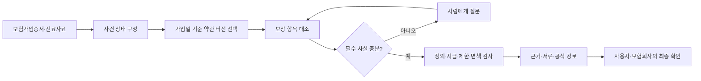
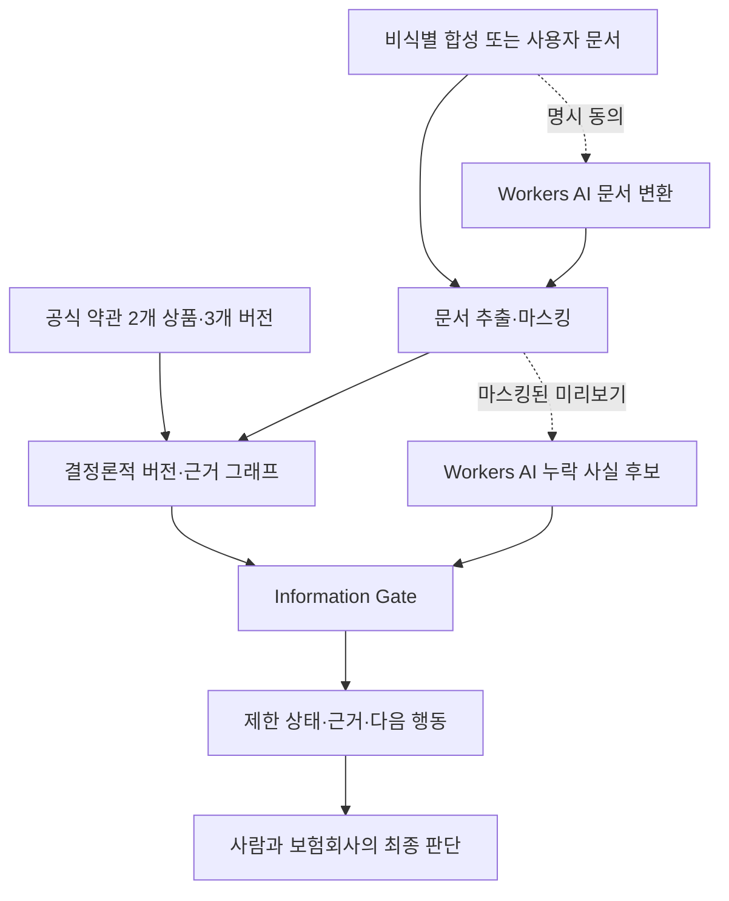

# 2026 금융 AI Challenge 기획서 — 보험금 길잡이 Agent

> 문서 상태: 예선 제출용 최신본
>
> 기준일: 2026-08-12
>
> 문서 원칙: 공식 양식의 항목명을 유지하고, 사실·구현·가설·한계를 구분한다.
>
> 구현 기준: [기능명세서](./feature-specification.md)
>
> 근거 기준: [주장·의사결정 근거 대장](./claim-evidence-matrix.md)

## 1. 서비스 명칭

**보험금 길잡이 Agent**

가입 당시 보험약관과 치료 사실을 대조해 **확인할 보장 항목·근거·다음 행동**을
정리하는 사람 중심 보험 확인 Agent

| 구분 | 제안 내용 |
| --- | --- |
| 핵심 사용자 | 고령 부모의 보험을 함께 확인하는 가족 보호자 — 현재 검증할 1차 사용자 가설 |
| 입력 | 보험가입증서, 진료자료, 사고·치료 설명, 추가 질문 답변 |
| 출력 | 확인할 보장 항목, 적용 약관 조항·쪽수, 미확인 조건, 필요 서류, 공식 확인 경로 |
| 권한 경계 | 지급 여부·금액을 확정하지 않으며, 보험회사와 사용자가 최종 확인 |
| 구현 범위 | 우체국보험 2개 상품·3개 약관 버전, 비식별 합성 사례, 실제 LangGraph 상태 그래프 |

## 2. 아이디어 기획 핵심내용

> **이미 알고 있는 보험금은 조회·청구할 수 있다. 보험금 길잡이 Agent는 그보다
> 앞선 질문, “내 치료와 계약에서 무엇을 확인해야 하는가”를 해결한다.**

| 문제 | Agent의 처리 | 사용자가 받는 결과 | MVP 증거 |
| --- | --- | --- | --- |
| 계약 시점에 따라 약관이 달라짐 | 상품코드·계약일·판매기간을 먼저 대조 | 가입 당시 적용 약관 버전 | 2개 상품·3개 버전 전환 |
| 치료 사실과 보장 조건이 여러 문서에 흩어짐 | 보험가입증서·진료자료·사건 설명을 사건 상태로 구조화 | 확인할 보장 항목 목록 | 준비 사례·사용자 문서 분석 |
| 지급 조항만 보면 예외를 놓칠 수 있음 | 정의·지급·제한·면책·서류 근거를 관계로 함께 확장 | 조항·쪽수·반대 근거가 포함된 근거 지도 | Claim Evidence Map |
| 핵심 사실이 없으면 판단 경로가 달라짐 | 추정하지 않고 질문한 뒤 같은 사건에서 재개 | `정보 필요`와 구체적 확인 질문 | Human-in-the-loop 분기 |
| 설명만으로 실제 행동이 어렵음 | 검증된 근거만 다음 행동으로 변환 | 필요 서류·보험사 질문·공식 경로 | Action Pack |

- **단순 챗봇 탈피**: 질문 한 번에 문장을 생성하지 않고, 사건 상태에 따라
  도구·검사·사람 확인 단계를 순서대로 실행한다.
- **실제 데이터 연결**: 공식 보험약관의 상품코드·판매기간·조항·쪽수·문서
  해시를 결과에 연결한다.
- **금융 AI의 권한 제한**: 생성형 AI는 동의 기반 문서 변환과 마스킹된 누락
  사실 후보 정리에만 사용한다. 약관 버전·근거·결과 상태는 결정론적으로 검증한다.
- **검증 가능한 데모**: 심사자는 실행 그래프, 질문 분기, 근거 원문, 실패 시
  안전 중단을 배포 URL에서 직접 재현한다.

## 3. 문제 정의 및 제안 배경

### 3.1 확인 이전의 정보 단절

보험 소비자에게는 서로 다른 두 개의 정보 단절이 존재한다.

| 정보 단절 | 확인된 근거 | 본 서비스와의 관계 |
| --- | --- | --- |
| 지급 사실 자체를 알지 못함 | 금융위원회는 2025년 말 기준 숨은보험금 10.3조 원을 안내하고, 발생 사실을 알지 못하는 경우 등을 원인으로 제시 | 보험 영역에서 ‘몰라서 확인하지 못하는 문제’가 실제로 존재한다는 인접 근거 |
| 청구 절차와 지급 설명을 따라가기 어려움 | 보험연구원 조사에서 불만족 응답자 179명 중 청구 절차 불편 39.7%, 지급 과정 안내 부족 54.7% | 사용자가 근거·절차를 한 번에 이해하도록 만드는 설계 근거 |
| 내 치료와 가입 보장을 대조하기 어려움 | 여러 문서·약관 버전·면책 조건을 함께 확인해야 한다는 업무 구조 | 본 팀이 MVP로 검증할 핵심 제품 가설 |

금융위원회의 10.3조 원은 **지급금액이 이미 확정됐지만 청구되지 않은 중도·만기·
휴면보험금**이다. 따라서 이를 본 서비스가 찾아낼 금액, 시장 규모 또는 성과로
사용하지 않는다. 2025년 약 80만 건·3조 2,470억 원이 환급됐다는 수치도 문제의
지속성을 설명하는 맥락으로만 사용한다.

보험연구원 수치 또한 전체 국민의 불편 비율이 아니다. 해당 조사의 전체 결과
표본은 보험금 청구·지급 경험이 있는 19~69세 성인 2,551명이며, 위 불만족 이유
문항의 응답자는 179명이다. 이 표본 경계를 문서에 함께 표시한다.

### 3.2 청구 전 확인 공백

기존 공식 채널은 각기 중요한 역할을 수행한다.

| 채널 | 잘하는 일 | 남는 질문 |
| --- | --- | --- |
| 내보험찾아줌 | 확정된 숨은보험금 조회·청구 | 내 치료에서 어떤 정액 보장 항목을 먼저 확인할지 |
| 실손24 | 알고 있는 실손보험 청구의 전산 실행 | 실손 외에 가입한 보장 항목이 있는지 |
| 보험회사 | 계약 조회·상담·지급 심사와 최종 결정 | 문의 전에 어떤 계약·조항·서류를 준비할지 |
| 보험금 길잡이 Agent | 사건·계약·약관을 대조해 확인 대상을 정리 | 지급 결정과 청구 실행은 공식 채널로 이관 |

따라서 본 서비스의 문제 정의는 다음과 같다.

> **사용자는 공식 조회·청구 채널이 없어서만 멈추는 것이 아니다. 자신의 치료
> 사실과 보험가입증서, 가입 당시 보험약관을 대조해 무엇을 확인할지 정리하지
> 못해 공식 채널에 도달하기 전에 멈춘다.**

### 3.3 핵심 사용자와 채널

1차 사용자는 **고령 부모의 보험을 함께 확인하는 가족 보호자**로 설정한다.
이는 현재 대표성까지 검증된 통계가 아니라 제품 설계 가설이다. 문서 촬영·업로드,
보험계약 확인, 공식 채널 이동을 가족이 보조하는 상황을 우선 시나리오로 삼고,
후속 사용자 조사에서 당사자와 보호자의 과업·용어·신뢰 요구를 분리 검증한다.

- 채널: 회원가입 없는 모바일·데스크톱 웹
- 접근성: 기본 본문 14px 이상, 큰글씨 모드, 한 단계 한 개의 주 행동
- 기본 사례: 전량 비식별 합성 문서
- 실제 사용자 문서: 선택 입력, 비저장, AI 외부 처리 전 명시 동의

## 4. 서비스 컨셉 및 차별성

### 4.1 판단 대체가 아닌 근거 준비

> **보험은 사람이 결정하고, Agent는 놓치지 않게 돕습니다.**

보험금 길잡이 Agent는 보험금 지급을 예측하는 모델이 아니다. 사용자의 사건을
완료해야 할 과업으로 받아 `문서 확인 → 약관 버전 선택 → 보장 항목 대조 →
부족한 사실 질문 → 근거 감사 → 다음 행동`을 수행하는 제한형 Agentic Workflow다.

그림 1. 실제 LangGraph 실행 순서. 화면은 실행된 노드와 대기·중단 이유를
React Flow로 표시한다.

### 4.2 Agent 방법론의 필요성

| 판단 과업 | 단순 검색·단발 답변의 한계 | Agent 방법론의 역할 |
| --- | --- | --- |
| 버전 선택 | 관련 문장을 찾아도 계약 당시 문서인지 보장하지 못함 | 검색 전에 상품코드·계약일·판매기간으로 대상을 제한 |
| 다문서 대조 | 보험가입증서·진료자료·약관의 사실이 한 질문에 모두 담기지 않음 | 사건 상태에 확인된 사실과 미확인 사실을 누적 |
| 예외 검토 | 유사한 지급 문장만 회수하면 면책·제한을 놓칠 수 있음 | 지급 근거와 연결된 정의·제한·면책을 강제 확장 |
| 정보 보완 | 정보가 없어도 그럴듯한 답변을 계속 생성할 수 있음 | 필수 사실이 없으면 중단하고 사람에게 질문 |
| 행동 전환 | 답변을 읽어도 무엇을 준비할지 다시 해석해야 함 | 감사 통과 근거만 서류·질문·공식 경로로 변환 |

핵심은 Agent의 수가 아니라 **상태·분기·중단·재개·감사**다. 실제 구현에서도
자율 Agent와 결정론적 도구를 구분한다.

| 구성 | 실제 책임 | 허용하지 않는 일 |
| --- | --- | --- |
| Case Analyst Agent | 사용자 목표와 사건 사실 구조화 | 지급 가능성·금액 생성 |
| Document Tool | 문서 텍스트 추출·마스킹 | 문서에 없는 사실 추정 |
| Version Resolver Tool | 상품코드·계약일·판매기간 대조 | 유사도만으로 버전 선택 |
| Coverage Matcher Agent | 확인된 사실과 보장 조건 대조 | 미확인 사실을 충족으로 간주 |
| Information Gate·Human Review | 누락 사실 식별·질문·재개 | 질문 없이 다음 단계 통과 |
| Evidence Auditor Agent | 버전·출처·쪽수·필수 근거 유형 검사 | 보험회사의 법적·의학적 판단 대체 |
| Action Planner Agent | 감사 통과 결과를 다음 행동으로 정리 | 청구 대행·손해사정·상품 권유 |

### 4.3 비교 우위

| 비교 기준 | 일반 약관 질의응답 | 공식 조회·청구 채널 | 보험금 길잡이 Agent |
| --- | --- | --- | --- |
| 시작점 | 사용자의 단일 질문 | 이미 알고 있는 계약·청구 건 | 사건과 문서 묶음 |
| 적용 약관 | 검색 결과 중심 | 보유 계약 기준 | 상품코드·계약일·판매기간 선확정 |
| 근거 | 관련 문장 | 조회·심사 결과 | 정의·지급·제한·면책·서류의 근거 경로 |
| 정보 부족 | 일반 답변 가능 | 추가 서류 요청 | 질문 후 재개 또는 안전 중단 |
| 최종 결과 | 설명 텍스트 | 조회·청구·지급 결정 | 확인 항목·미확인 조건·다음 행동 |

## 5. 활용 데이터 및 생성형 AI 모델 적용 방안

### 5.1 공식 실제 데이터

예선 MVP의 결과에 직접 연결된 범위는 **2개 상품·3개 약관 버전**이다.

| 상품·버전 | 상품코드 | 공식 판매기간 | MVP 사례·근거 |
| --- | --- | --- | --- |
| 무배당 우체국와이드건강보험 2112 | P400051~P400054 | 2021-12-01~2025-04-02 | S52 골절 관련 정의·지급·제한·면책·서류 |
| 무배당 우체국와이드건강보험 2504 | P400073~P400076 | 2025-04-03~2025-06-04 | S52 골절 관련 정의·지급·제한·면책·서류 |
| 무배당 우체국온라인입원수술보험 2112 | P600107 | 2021-12-01~2025-04-02 | 4일 이상 입원 요건·입원/수술 정의·면책·서류 |

함께 사용하는 공식 출처는 우정사업본부 약관 API·공시실, 국가법령정보센터
보험 표준약관, 손해보험협회 소비자포털의 청구서류 기준이다. 결과에는 원문 URL,
적용 기간, 조항, PDF 쪽수, SHA-256을 표시한다. 개인 보험가입증서·진료자료와
평가 사건은 공식 데이터가 아니라 **비식별 합성 데이터**다.

### 5.2 처리 구조와 AI 역할

그림 2. 공식 실제 데이터, 합성·사용자 문서, 선택형 AI의 처리 경계.

| 처리 구간 | 구현 방식 | 출력 | 안전장치 |
| --- | --- | --- | --- |
| 문서 변환 | 동의 시 Workers AI Markdown Conversion | 추출 텍스트 | 외부 전송 고지·비저장 |
| 누락 사실 보조 | `@cf/meta/llama-3.1-8b-instruct-fast` JSON Mode | 누락 후보·짧은 질문 | 마스킹된 미리보기만 전달 |
| 사건 오케스트레이션 | LangGraph 상태 그래프 | 노드·분기·중단·재개 trace | 각 단계 입력·출력 공개 |
| 약관 버전·근거 | 결정론적 메타데이터·관계 그래프 | 적용 버전·필수 근거 묶음 | LLM이 버전·인용 생성 불가 |
| 근거 감사 | 출처·버전·쪽수·조항 유형 검사 | 통과·실패 사유 | 실패 시 `확인 불가` |

현재 런타임은 임베딩 검색·Hybrid RAG·범용 LLM 기반 약관 검색을 수행하지 않는다.
또한 인용 감사 통과는 **문서·버전·쪽수·필수 근거 유형의 존재와 연결성**을
확인한다는 뜻이지, 보험금 지급에 대한 법률·의학적 해석의 정확성을 증명하지 않는다.

### 5.3 사람 중심 통제

2026년 금융위원회의 금융분야 AI 가이드라인은 현 단계의 AI를 보조 수단으로
두고 최종 의사결정과 책임은 사람에게 두는 방향을 제시한다. 본 MVP는 이를
다음 설계로 반영한다.

- 결과 상태를 `확인 권장`, `정보 필요`, `가능성 낮음`, `확인 불가`로 제한
- 지급 확정·예상 금액·기존 청구 여부 생성 금지
- 핵심 사실 누락·버전 불일치·근거 감사 실패 시 안전 중단
- AI 외부 처리의 선택권과 마스킹·비저장 경계 고지
- 공식 보험회사 채널에서 사람의 최종 확인 유도

### 5.4 현재 검증 범위

| 평가 묶음 | 구성 | 측정 항목 | 해석 제한 |
| --- | --- | --- | --- |
| 결정론적 회귀 50건 | 지원 36건·미지원/필수 사실 누락 14건의 합성 fixture | 버전 선택·근거 완전성·안전 중단·trace 무결성 | 코드 변경의 회귀 안전성 확인 |
| 분리 수작업 합성 점검 15건 | 회귀 생성 규칙과 분리해 사람이 라벨링한 합성 사건 8/7건 | 같은 네 계약 지표 | 작은 스모크 점검이며 통계적 성능·실사용 정확도 아님 |

두 묶음의 현재 계약 지표는 모두 통과하지만, 실제 고객 분포·OCR 품질·예외적
보험사건·보험금 지급 정확도를 대표하지 않는다. 따라서 `100% 정확도`라고
표현하지 않는다.

## 6. 기대 효과 및 확장 가능성

### 6.1 즉시 확인 가능한 효과

| 수혜자 | MVP에서 바로 확인 가능한 변화 | 아직 증명하지 않은 효과 |
| --- | --- | --- |
| 가족 보호자 | 확인할 보장 항목·근거·미확인 조건·서류가 한 흐름에 정리 | 실제 미청구 감소·보험금 수령 증가 |
| 보험 소비자 | 가입 시점 약관과 현재 치료 사실의 연결 경로 확인 | 지급 가능성·확정 금액·처리 기간 단축 |
| 보험 상담 채널 | 상품코드·계약일·조항·질문이 구조화된 문의 준비 | 상담 비용 감소·처리 생산성 향상 |
| 심사자·운영자 | 같은 사례로 실행 trace·근거·안전 중단 재현 | 타 보험사·전체 상품 일반화 |

향후 사용자 검증에서는 `확인 과업 완료율`, `올바른 약관 버전 선택률`, `면책
동반 근거 확인률`, `공식 채널 이동 전 준비 서류 완성도`, `과업 시간`을 측정한다.
보험금 수령액 증가는 보험사 지급 데이터 없이 성과로 주장하지 않는다.

### 6.2 확장 방향

- **PolicyOps**: 신규 공식 약관 감지 → 해시·시행일·조항 Diff → 회귀 평가 →
  사람 승인 → 별도 배포의 순서로 지식 갱신
- **상품 범위**: 우체국보험 검증 범위에서 민간 보험사의 허가·공시 조건을
  확인한 상품군으로 단계 확대
- **사건 범위**: 골절·입원·수술에서 진단·후유장해·중도보험금 확인으로 확대
- **기관 연계**: 보험회사·공식 조회·청구 채널의 사전 확인 보조 도구로 연결
- **타 영역**: 버전·예외·증빙이 중요한 복지급여·의료비 지원·연금 문서 확인

`자가 개선`은 모델이 지급 규칙을 임의로 학습한다는 뜻이 아니다. 새 공식 문서를
감지하고 검증·사람 승인을 거쳐 근거 구조를 갱신하는 **사람 승인형 지식 적응**이다.

## 7. 검증 가능한 신뢰 계약

### 7.1 네 가지 결과 상태

| 상태 | 사용 조건 | 사용자 행동 |
| --- | --- | --- |
| `확인 권장` | 계약·사건·필수 근거가 연결됐으나 보험회사 확인이 필요 | 조항·서류를 확인해 공식 채널 문의 |
| `정보 필요` | 수술·입원·기존 청구 등 필수 사실 누락 | 질문에 답하거나 공식 자료 확인 |
| `가능성 낮음` | 현재 입력에서 필요한 조건이 확인되지 않음 | 조건을 증명할 다른 자료가 있는지 확인 |
| `확인 불가` | 버전·출처·근거 검사 실패 또는 보험사 내부 정보 필요 | 보험회사에 직접 확인 |

### 7.2 90초 심사 재현

1. `손목 골절` 합성 사례를 선택하고 분석을 시작한다.
2. `수술은 안 했어요`라고 답해 Human-in-the-loop 재개를 확인한다.
3. P400073 / 2504 약관과 정의·지급·제한·면책·서류 근거를 확인한다.
4. `면책 함정` 사례에서 `잘 모르겠어요`를 선택해 안전 중단을 확인한다.
5. 실행 캔버스에서 각 Agent·Tool·Gate의 입력·출력·중단 이유를 확인한다.

심사자가 기억할 세 문장은 다음과 같다.

1. **계약일에 맞는 약관 버전을 먼저 고른다.**
2. **지급 조항과 정의·제한·면책을 함께 확인한다.**
3. **근거가 부족하면 답을 만들지 않고 사람에게 묻는다.**

## 출처

- [2026 금융 AI Challenge 대회 페이지](https://daker.ai/public/hackathons/2026-finance-ai-challenge)
- [금융위원회, 숨은보험금 10.3조 원 안내](https://www.fsc.go.kr/po010103/87270)
- [보험연구원, 2022 보험소비자 행태조사](https://www.kiri.or.kr/report/downloadFile.do?docId=270439)
- [금융위원회, 금융분야 AI 가이드라인 개정](https://www.fsc.go.kr/po010101/87142?srchCtgry=1)
- [공공데이터포털, 우체국보험 상품별 약관 정보](https://www.data.go.kr/data/15111699/openapi.do)
- [우체국보험 공시실](https://www.epostlife.go.kr/ISB.RetrieveDisclosureDetailList.ins)
- [국가법령정보센터, 보험업감독업무시행세칙](https://www.law.go.kr/LSW/admRulInfoP.do?admRulSeq=2200000108867&chrClsCd=010202)
- [손해보험협회 소비자포털, 보험금 청구서류 안내](https://consumer.knia.or.kr/m/consumer/insurance-guide/0202.do)
- [Cloudflare Workers AI JSON Mode](https://developers.cloudflare.com/workers-ai/features/json-mode/)
- [Cloudflare Workers AI Markdown Conversion](https://developers.cloudflare.com/workers-ai/features/markdown-conversion/usage/binding/)
