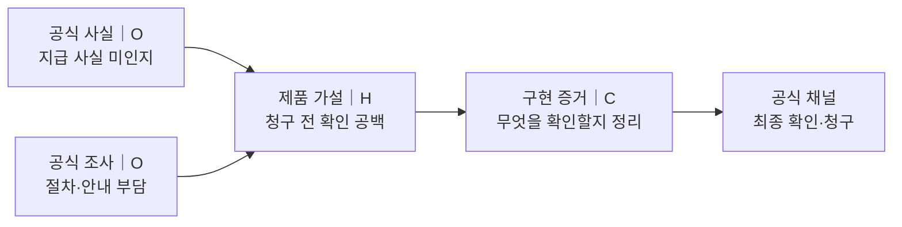
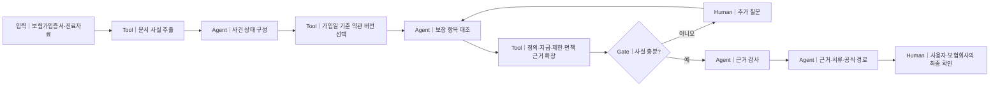
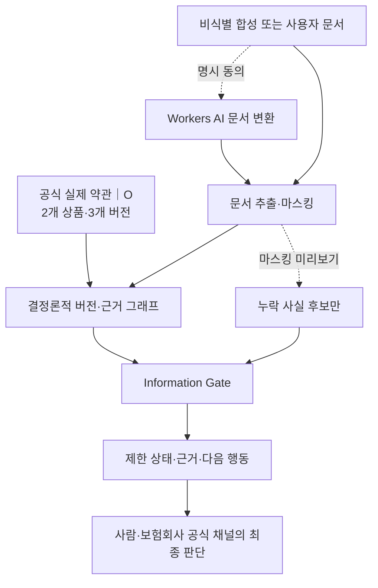
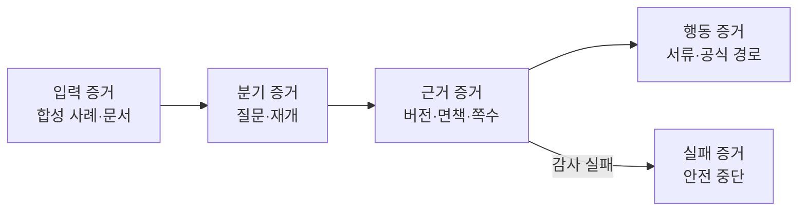

# 제출 문서용 시각 자료

기획서와 기능명세서의 시각 자료 원본이다. 모든 그림은 하나의 심사 질문에
답하고, 실제 MVP에서 확인 가능한 입력·분기·근거·사람의 권한을 표시한다.

## 1. 문제·근거 연결

**심사 질문:** 실제 문제가 증명됐는가, 아니면 인접 통계를 과장했는가?

그림 설명: 10.3조 원과 소비자 조사는 인접 문제의 공식 근거다. 청구 전 확인
공백은 이 근거와 업무 구조에서 도출한 제품 가설이며, MVP와 사용자 조사로
검증한다.

원본: [`problem-evidence-chain.mmd`](./diagrams/problem-evidence-chain.mmd)

## 2. Agentic 근거 확인 흐름

**심사 질문:** 왜 단순 검색이 아니라 Agent가 필요한가?

그림 설명: Agent 수가 아니라 상태·분기·중단·재개·감사가 차별점이다. 화면은
실제로 실행된 LangGraph 노드만 활성화한다.

원본: [`agentic-evidence-flow.mmd`](./diagrams/agentic-evidence-flow.mmd)

## 3. 데이터·AI 권한 경계

**심사 질문:** 무엇이 실제 데이터이고, AI에는 어떤 권한이 있는가?

그림 설명: 공식 약관과 판매기간은 실제 데이터이며, 개인 문서와 평가 사건은
합성 또는 사용자 입력이다. AI는 문서 변환·누락 사실 후보만 담당한다.

원본: [`data-and-safety-boundary.mmd`](./diagrams/data-and-safety-boundary.mmd)

## 4. 90초 검증 계약

**심사 질문:** 성공 결과뿐 아니라 실패 시 안전 동작도 재현되는가?

그림 설명: 심사자는 입력, Human-in-the-loop, 공식 근거, Action Pack, 안전
중단을 같은 사례 흐름에서 확인한다.

원본: [`verification-contract.mmd`](./diagrams/verification-contract.mmd)

## 5. 시각 언어

| 역할 | 색·도형 | 의미 |
| --- | --- | --- |
| 공식 출처·근거 | 증빙 블루, 실선 | 외부 원문으로 확인 가능한 사실 `O` |
| Agent·검증 결과 | 숲색·세이지, 둥근 사각형 | 현재 코드로 재현되는 처리 `C` |
| Tool·일반 입력 | 중립 세이지 회색 | 결정론적 처리 또는 사용자 입력 |
| Gate·Human·가설 | 앰버, 분기·점선 | 사람 확인, 동의, 미확인 제품 가설 `H` |
| 실패 | 앰버 테두리와 명시적 문장 | 답변 생성 대신 질문 또는 안전 중단 |

- 모든 그림은 `입력 → 처리 → 검증 → 사람의 권한`을 왼쪽에서 오른쪽으로 읽는다.
- 같은 역할은 기획서·기능명세서·웹 실행 캔버스에서 같은 명칭과 색을 사용한다.
- 장식 아이콘·3D·사진은 사용하지 않고, 조항·쪽수·해시 등 증거가 있는 노드만
  시각화한다.
- PDF 캡션에는 `실제 MVP 기준, 2026-08-12`와 해석 한계를 함께 둔다.
