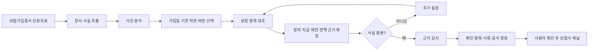
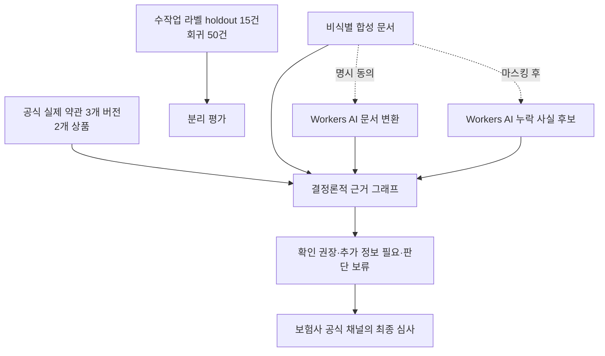

# 제출 문서용 시각 자료

기획서와 기능명세서에 사용할 다이어그램의 최신 원본이다. 다이어그램은 실제
MVP의 동작과 데이터 경계를 설명하기 위한 것이며, 미구현 기술을 표현하지 않는다.

## 1. Agentic 근거 확인 흐름

사용자에게 보이는 LangFlow형 실행 캔버스와 같은 순서다. 단, 화면은 실제
LangGraph trace가 발생한 노드만 활성화한다.

그림 설명: 모델이 지급 여부를 결정하는 흐름이 아니다. 가입일에 맞는 보험약관
버전을 고르고, 보상 조항과 함께 정의·제한·면책을 확인한 뒤, 부족한 사실은
사람에게 되묻는다.

원본: [`agentic-evidence-flow.mmd`](./diagrams/agentic-evidence-flow.mmd)

## 2. 실제 데이터·외부 AI 처리 경계

그림 설명: 보험약관과 판매기간은 공식 실제 데이터이며, 예선 입력 문서는
비식별 합성 데이터다. PDF·이미지 변환은 사용자가 동의할 때만 Cloudflare Workers
AI에 전송되고, 마스킹된 미리보기 기반 AI 도구는 누락 사실 후보만 정리한다.

원본: [`data-and-safety-boundary.mmd`](./diagrams/data-and-safety-boundary.mmd)

## 3. 제출 자료 삽입 원칙

- 기획서 4번에는 그림 1을, 5번에는 그림 2를 넣는다.
- 기능명세서 3번에는 그림 1을, 4번에는 그림 2를 넣는다.
- 각 그림 하단에 `실제 MVP 기준, 2026-08-08`와 데이터 출처 또는 외부 처리
  고지를 함께 둔다.
- PDF에서는 흐름을 보조하는 그림으로만 사용하며, 최종 지급 여부를 계산하거나
  실제 고객 데이터를 학습한다는 인상을 주는 아이콘·화살표는 사용하지 않는다.
