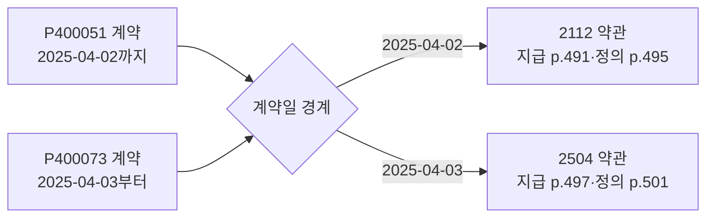
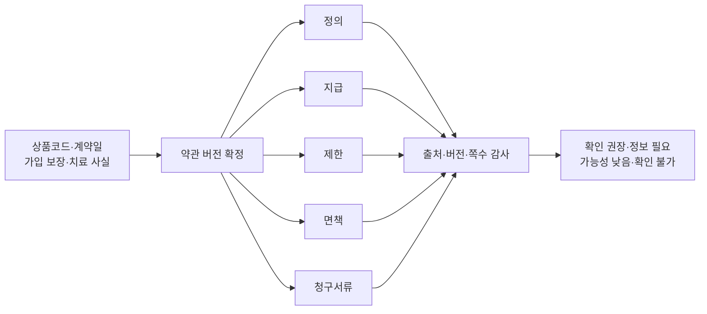
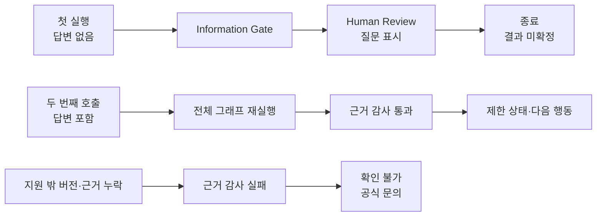

# 예선 제출 시각자료 기준

> 기준일: 2026-08-13
>
> 원칙: 시각자료 하나는 심사 질문 하나에 답하며, 관찰 사실(O)·현재 구현(C)·
> 시연/평가(S)·향후 계획(P)을 섞지 않는다.

## 1. 약관 버전 경계

**심사 질문:** 왜 일반 약관 검색이 아니라 계약일 기반 버전 선택이 필요한가?

- 증거 상태: 공식 약관 메타데이터(O) + 현재 버전 선택 구현(C)
- 핵심 문장: 같은 S52 골절이라도 계약일 경계에 따라 다른 조항·쪽수를 사용한다.
- 금지 해석: 두 버전의 지급 결과가 반드시 다르다고 주장하지 않는다.
- 원본: [`diagrams/policy-version-boundary.mmd`](./diagrams/policy-version-boundary.mmd)

## 2. 필수 근거 묶음

**심사 질문:** 지급 문장 하나를 그럴듯하게 인용하는 오류를 어떻게 막는가?

- 증거 상태: 공식 조항(O) + 버전별 근거 조회·감사 구현(C)
- 핵심 문장: 같은 버전의 정의·지급·제한·면책·청구서류 5유형이 모두 있어야 한다.
- 금지 해석: 관계 그래프 추론, Microsoft GraphRAG, 법률·의학적 최종 해석을 구현했다고 하지 않는다.
- 원본: [`diagrams/mandatory-evidence-bundle.mmd`](./diagrams/mandatory-evidence-bundle.mmd)

## 3. 실행 결과 비교

**심사 질문:** 사람 확인과 안전 중단은 실제로 어디에서 일어나는가?

- 증거 상태: 실제 LangGraph 분기와 trace(C)
- 핵심 문장: 첫 실행은 질문 상태로 끝나고, 답변 뒤 전체 그래프를 다시 호출한다.
- 금지 해석: 체크포인터·영속 상태 기반 중단 지점 재개라고 하지 않는다.
- 원본: [`diagrams/trace-outcome-comparison.mmd`](./diagrams/trace-outcome-comparison.mmd)

## 4. 평가 표기

| 표시 | 정확한 명칭 | 측정 범위 | 표시하지 않는 표현 |
| --- | --- | --- | --- |
| 50건 | 규칙 경계값 회귀 | 버전·근거·안전 중단·trace | AI 정확도·지급 정확도 |
| 15건 | 수작업 라벨 경계 사례 | 같은 상품군의 작은 스모크 점검 | 독립 검증셋·실사용 성능 |
| 질문 흐름 | 브라우저 수동 재현 | 답변 전 종료·답변 후 재호출 | 평가셋으로 검증 완료 |

## 5. 시각 언어

| 의미 | 색·형태 | 상태 |
| --- | --- | --- |
| 공식 근거 | 짙은 남색, 직선형 카드 | O |
| 현재 실행 | 숲색·청록, 둥근 카드 | C |
| 사람 확인 | 호박색, 마름모·강조 테두리 | C |
| 안전 중단 | 적갈색, 테두리 카드 | C |
| 미검증·향후 | 회색, 점선 | H/P |

본문 표와 그림의 문구는 기획서·기능명세서·웹 UI에서 같은 용어를 사용한다.
