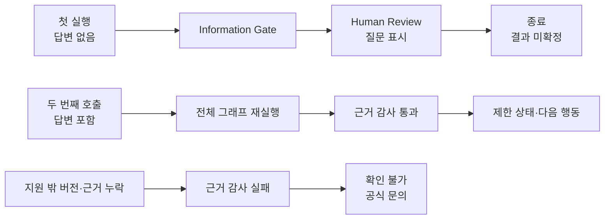
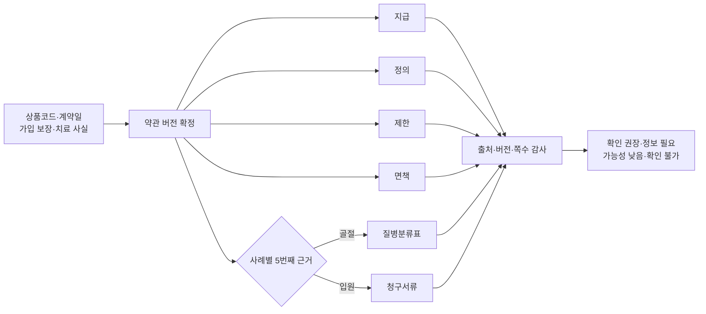
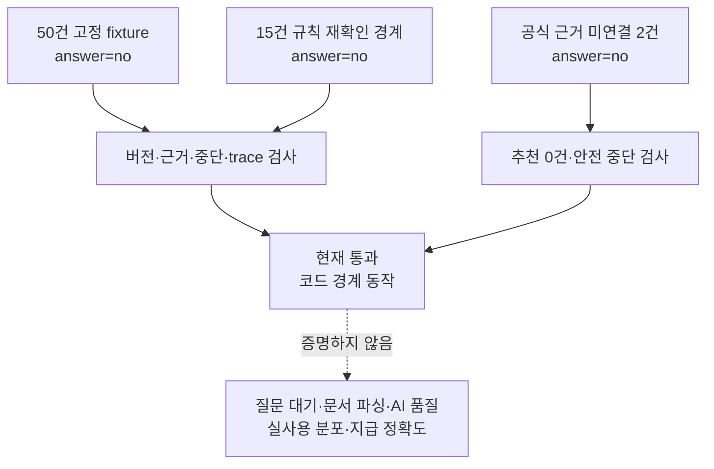

# 2026 금융 AI Challenge 기능명세서 — 보험금 길잡이 Agent

> 문서 상태: 예선 제출용 최신본
>
> 기준일: 2026-08-18
>
> 배포 URL: <https://finai26.turtlehwan.dev>
>
> 테스트 계정: 필요 없음
>
> 작성 기준: 배포 URL과 현재 코드에서 재현되는 기능만 구현 범위로 기록한다.

## 1. MVP 구현 범위

**본 MVP는 2개 상품·3개 공식 약관 버전 안에서 사건·계약·치료 사실을 대조하고,
한 번의 확인 질문과 근거 감사를 거쳐 확인 항목·서류·공식 경로를 제공한다.**

대표 과업은 `어머니의 손목 골절로 실손은 청구했지만, 다른 보장 항목도 확인해야
하는지 모르겠다`는 비식별 합성 상황이다. 기본 시연에서는 미리 구조화한 합성
계약·치료 사실을 불러오고, `내 문서로 확인하기`에서는 사용자가 넣은 보험가입증서와
진료자료를 별도 파서로 구조화한다. Agent는 두 입력 모두에서 가입 당시 보험약관을
선택한다. 수술 여부가 빠져 있으면 질문하고, 답변 뒤에는 근거 조항·쪽수·준비
자료·보험회사에 물어볼 질문을 한 흐름으로 보여 준다. 지급 가능성은 확정하지 않는다.

### 1.1 구현 범위

| 범위 | 현재 구현 | 코드·데이터 근거 |
| --- | --- | --- |
| 공식 약관 | 우체국보험 2개 상품·3개 버전의 판매기간·조항·쪽수·SHA-256 | `lib/claim-guide/policies.ts` |
| 사례 데이터 | 공식 약관 연결 사례 3종과 안전 중단 시연 2종, 합성 보험가입증서·진료자료 | `lib/claim-guide/cases.ts`, `public/samples/` |
| 사용자 문서 | PDF·TXT 최대 2개, 동의 시 PDF·JPG·PNG·WEBP 변환 | 문서 입력 UI·API |
| 실행 구조 | 실제 LangGraph의 순차 노드·조건 분기·첫 실행 질문 종료·답변 후 전체 재호출 | `lib/claim-guide/agent-graph.ts` |
| 생성형 AI | 동의 기반 문서 변환과 마스킹된 누락 사실 후보·짧은 질문 | Cloudflare Workers AI |
| 근거 처리 | 계약일 버전 선택 후 공통 4유형과 사례별 1유형을 버전별로 동반 조회 | `lib/claim-guide/policies.ts` |
| 결과 | 네 제한 상태, 근거 원문, 미확인 조건, 필요 서류, 공식 확인 경로 | 분석 결과·근거·다음 행동 화면 |
| 평가 | 규칙 경계값 회귀 50건, 규칙 재확인 경계 15건, 공식 근거 미연결 안전 중단 2건 | `lib/claim-guide/evaluation.ts`, `data/evaluation/boundary-v1.json` |

실행 순서는 `사건 구조화 → 문서 사실 정규화 → 약관 버전 선택 → 보장 규칙 대조 →
필수 근거 동반 조회 → 정보 확인 단계 → 근거 감사 → 다음 행동`이다. 답변이 없으면
첫 호출은 `human_review`에서 종료하고, 답변이 들어오면 같은 입력에 답변을 추가해
전체 그래프를 다시 호출한다.

실행 캔버스의 노드 위치는 읽기 쉬운 고정 배치이며, 서버 trace가 실행한 노드의
상태·입력·출력을 덧입힌다. 동의형 `AI 문서 이해`는 LangGraph 시작 전 선택형
전처리로 표시한다. 이 외부 호출의 소요시간은 현재 수집하지 않으며, 그래프 내부
노드만 `performance.now()` 기준 경과 시간을 표시한다.

### 1.2 제외 범위

- 보험금 지급 여부·예상 금액·기존 청구 이력 확정
- 보험회사 지급심사·손해사정·청구 대행·상품 추천
- 실사용자 보험·진료·지급 이력을 사용한 모델 학습·성능 평가
- 체크포인터·영속 상태 기반 중단 지점 재개
- 임베딩 검색·Hybrid RAG·범용 LLM 약관 검색·관계 그래프 순회
- 민간 보험사 전체 또는 우체국보험 전체 상품 지원
- 모든 스캔·저해상도·손상·복잡 표 문서의 변환 정확성 보장
- 승인 즉시 운영 약관 지식을 변경하는 무인 PolicyOps

## 2. 주요 기능 목록

**각 기능은 이름보다 `무엇을 입력하면 화면이 어떻게 달라지고, 실패하면 어디에서
멈추는가`를 기준으로 명세한다. 심사자는 배포 URL에서 같은 동작을 직접 재현할 수
있다.**

### 2.1 입력 기능

| 기능명 | 실제 동작 | 화면 | 런타임 근거 | 상태 |
| --- | --- | --- | --- | --- |
| 합성 사례 선택 | 골절 2504·골절 2112·5일 입원·중도보험금 안전 중단·면책 안전 중단을 불러옴 | 사례 선택 | `getClaimCase()` | 구현 |
| 사용자 문서 입력 | 텍스트 레이어 PDF·TXT에서 계약·진료 사실 추출 | 내 문서로 확인 | 문서 파서 API | 구현 |
| 동의형 AI 문서 변환 | 동의 시 PDF·JPG·PNG·WEBP를 Workers AI로 텍스트화 | 내 문서로 확인 | Markdown Conversion | 구현 |
| 개인정보 마스킹 | 주민등록번호·전화번호·증권번호와 라벨이 붙은 이름 값을 결과 전 마스킹 | 문서 확인 | 서버 마스킹 | 구현 |
| 사건 상태 구성 | 상품코드·계약일·보장명·진단코드·입원 사실 기록 | 분석 과정 | 문서 사실 도구 (`document_tool`) | 구현 |

### 2.2 근거 기능

| 기능명 | 실제 동작 | 화면 | 런타임 근거 | 실패 상태 |
| --- | --- | --- | --- | --- |
| 약관 버전 선택 | 상품코드·계약일·공식 판매기간을 대조 | 분석 과정·결과 | 버전 선택 도구 (`version_resolver`) | `확인 불가` |
| 보장 규칙 대조 | 가입 보장·S52 진단·4일 이상 입원 등 지원 조건 대조 | 분석 과정·결과 | 보장 대조 도구 (`coverage_matcher`) | 근거 감사 차단 |
| 필수 근거 동반 조회 | 선택 버전의 지급·정의·제한·면책과 사례별 분류표 또는 서류 반환 | 근거 약관 | 근거 묶음 도구 (`evidence_bundle`) | 필수 유형 누락 |
| 근거 감사 | 공식 URL·버전·조항·쪽수·필수 유형 존재 검사 | 근거 약관·분석 과정 | 근거 감사 단계 (`evidence_auditor`) | `확인 불가` |
| 근거 지도 | 사건 → 진단 → 보장 항목 → 약관 → 다음 행동 표시 | Claim Evidence Map | `@xyflow/react` | 원인·종료 상태 표시 |

`evidence_bundle`은 선택된 약관 버전에 미리 검증해 둔 필수 근거를 동반 반환하는
도구다. Microsoft GraphRAG, 관계 그래프 순회, 임베딩 검색은 수행하지 않는다.

### 2.3 사람 중심 기능

| 기능명 | 실제 동작 | 화면 | 런타임 근거 | 상태 |
| --- | --- | --- | --- | --- |
| 한 번의 확인 질문 | 답변이 없으면 사례별 질문 1건을 표시하고 첫 실행 종료 | 정보 확인 | `information_gate` → `human_review` → `END` | 구현 |
| 답변 후 재호출 | 답변을 같은 사례·문서에 추가해 전체 LangGraph를 다시 실행 | 정보 확인·분석 과정 | `runClaimGraph({ answer })` 재호출 | 구현 |
| 제한 결과 상태 | `확인 권장`·`정보 필요`·`가능성 낮음`·`확인 불가`와 이유 표시 | 분석 결과 | `buildResults()` | 구현 |
| 다음 행동 | 필요 서류·보험회사 질문·공식 경로 정리 | 다음 행동 | `action_planner` | 구현 |
| 실행 캔버스 | 고정 배치 위에 실제 trace의 역할·입력·출력·상태를 표시하고 측정된 노드 시간만 표기 | 분석 과정 | `@xyflow/react` | 구현 |
| 글·음성 보조 | 글 요청과 지원 브라우저의 Web Speech 요청을 제한된 화면 명령으로 해석 | 정보 확인·결과 | 브라우저 Web Speech API | 보조 기능 |
| 큰글씨·반응형 | 최소 14px, 큰글씨 설정 저장, 320px 이상 재배치 | 전체 | CSS·접근성 설정 | 구현 |

### 2.4 검증·운영 기능

| 기능명 | 실제 동작 | 화면 | 해석 경계 | 상태 |
| --- | --- | --- | --- | --- |
| 규칙 경계값 회귀 | 고정 합성 fixture 50건의 네 실행 계약 검사 | 내부 평가 | 질문 대기·문서 파싱·AI 품질 미포함 | 구현 |
| 규칙 재확인 경계 점검 | 같은 상품군의 합성 사건 15건을 공식 약관 기반 기대값과 비교 | 내부 평가 | 독립 holdout·실사용 성능 아님 | 구현 |
| 공식 근거 미연결 안전성 | 중도보험금·면책 합성 시나리오 2건의 추천 차단 검사 | 내부 평가 | 실제 해당 보장의 해석·지급 성능 아님 | 구현 |
| 평가 한계 고지 | 실제 지급 정확도·실사용자 분포를 대표하지 않음을 표시 | 내부 평가 | 수치 과대 해석 방지 | 구현 |
| PolicyOps 검토 시연 | 공식 문서 버전·해시·조항 변경과 승인 상태 표시 | PolicyOps | 운영 인덱스 자동 변경 없음 | 구현 |

## 3. 사용자 이용 흐름

**심사 흐름은 `사례를 고른다 → 질문에 답한다 → 근거를 연다 → 다음 행동을
확인한다`의 네 동작으로 끝난다. 실행 그래프는 이 사용자 흐름을 설명하는 증거이며,
별도의 기술 관람 과업이 아니다.**

### 3.1 기본 흐름

그림 1. 실제 실행 계약. 답변 시 체크포인트에서 이어가는 것이 아니라 같은 사건을
다시 호출하며, 근거가 불완전하면 `확인 불가`로 끝난다.

1. 사용자가 배포 URL에 접속한다.
2. `손목 골절` 합성 사례를 선택하고 `이 사례 분석하기`를 누른다.
3. 사건 구조화·준비 사례 사실 로드·버전 선택·보장 대조·근거 조회 trace를 확인한다.
4. 첫 호출이 수술 여부 질문을 표시한 상태로 끝나는 것을 확인한다.
5. 답변을 선택하면 같은 사례·문서·답변으로 전체 그래프가 다시 실행된다.
6. 제한 결과 상태·이유·미확인 조건을 확인한다.
7. 공식 URL·약관 버전·조항·PDF 쪽수·SHA-256을 확인한다.
8. 필요 서류·보험회사 질문·공식 경로를 확인한다.
9. 보험회사 또는 공식 조회·청구 채널에서 사용자가 최종 확인한다.

### 3.2 사용자 문서 흐름

1. `내 문서로 확인하기`에서 PDF·TXT를 최대 2개 넣는다.
2. 이미지·스캔 문서는 AI 보조를 켜고 외부 처리 고지에 동의한다.
3. 마스킹된 추출 결과에서 상품코드·계약일·보장명·진단코드를 확인한다.
4. 현재 검증 상품·사례에 해당하면 같은 LangGraph 근거 흐름을 실행한다.
5. 지원 범위를 벗어나거나 근거가 부족하면 `확인 불가`와 공식 문의 경로를 받는다.

## 4. AI 및 데이터 처리 방식

**생성형 AI는 문서를 읽기 쉬운 입력으로 바꾸고 누락 사실 후보를 제안하지만,
약관 버전·인용·결과 상태는 결정론적 도구와 감사 규칙이 통제한다.**

### 4.1 실행 책임

그림 2. 지급·정의·제한·면책 네 유형에 골절은 질병분류표, 입원은 청구서류를
더해 사례별 필수 5유형을 검사한다. 골절의 청구서류·지급표는 결과 화면의 보조
원문이며 개인별 지급액 계산에는 쓰지 않는다.

| 구성요소 | 입력 | 출력 | 금지된 권한 | 실패 시 동작 |
| --- | --- | --- | --- | --- |
| Workers AI 문서 변환 | 동의한 PDF·이미지 원본 | 변환 텍스트 | 보험 사실·결과 상태 판단 | 실패 고지, 텍스트 입력 안내 |
| Workers AI 누락 사실 도구 | 서버가 재마스킹한 미리보기 | 누락 후보·짧은 질문 JSON | 약관·버전·인용·금액 생성 | 규칙 질문 또는 수동 입력 |
| LangGraph | 사건 상태·노드 결과 | 실행 순서·분기·종료 trace | 보험회사 최종 판단 | 오류 노드·종료 이유 반환 |
| Version Resolver | 상품코드·계약일·판매기간 | 적용 약관 버전 | 유사도 추정 | `확인 불가` |
| Evidence Bundle Tool | 적용 버전·사례 유형 | 공통 4유형+분류표 또는 서류 | 관계 추론·범용 검색 | 필수 유형 누락 표시 |
| Evidence Auditor | 버전·근거 묶음·공식 메타데이터 | 통과 여부·실패 사유 | 법률·의학적 최종 해석 | `확인 불가` |
| Action Planner | 감사 결과·사례별 준비 항목 | 제한 상태·자료·질문·공식 경로 | 새 서류 요건 생성·지급 확정·청구 대행 | 공식 문의만 제공 |
| AI Rate Limiter | 비용 발생 AI 경로 | 경로별 분당 30회 허용 여부 | 정확한 사용량 과금·사용자 인증 | 초과 시 HTTP 429·60초 후 재시도 |

### 4.2 데이터 경계

| 단계 | 데이터 | 공개·저장 경계 |
| --- | --- | --- |
| 공식 지식 | 우체국보험 2개 상품·3개 약관 버전, 표준약관, 공식 서류 안내 | URL·판매기간·쪽수·해시 공개, 원문 전체 재배포 없음 |
| 데모 입력 | 비식별 합성 보험가입증서·진료자료·사건 사실 | 실제 개인·청구·지급 이력 미사용 |
| 사용자 입력 | PDF·TXT, 동의 시 PDF·JPG·PNG·WEBP, 질문 답변 | 원본을 DB·파일시스템·모델 학습에 저장하지 않음 |
| 중간 상태 | 마스킹된 미리보기, 계약·치료 사실, 적용 버전, 실행 trace | 요청·응답 처리 범위에서 사용 |
| 최종 출력 | 제한 상태·이유·근거·미확인 조건·서류·공식 경로 | 지급 여부·확정 금액 제외 |

### 4.3 개인정보·민감정보

- 회원가입과 실제 개인 데이터 입력은 심사 흐름에 필요하지 않다.
- 주민등록번호·전화번호·증권번호와 `성명·환자명·피보험자·계약자` 등 라벨이
  붙은 이름 값을 기본 파싱 결과에서 마스킹한다.
- AI 보조를 켜면 원본 문서가 Cloudflare Workers AI 변환 서비스에 전송됨을
  토글 옆에서 고지하고 명시 동의를 받는다.
- 일반 LLM 도구에는 원본이 아닌 서버 측 재마스킹 미리보기만 전달한다.
- 문서 원본을 서비스 파일시스템·데이터베이스·모델 학습에 저장하지 않는다.
- 음성 입력은 지원 브라우저에서 사용자가 마이크를 누른 경우만 시작하며,
  브라우저 제공자의 외부 인식 서비스 전송 가능성과 서버 원음성 비저장을 고지한다.

### 4.4 평가 경계

그림 3. 50건과 15건은 같은 상품군의 합성 입력이고, 별도 2건은 공식 약관이 없는
시나리오의 추천 차단만 검사한다. 모두 답변을 고정해 실행하므로 독립 검증셋이나
실제 보험금 지급 정확도로 해석하지 않는다.

| 평가 묶음 | 사례 | 현재 검사 | 해석 한계 |
| --- | --- | --- | --- |
| 규칙 경계값 회귀 | 50건: 지원 36·미지원/누락 14 | 버전 선택·근거 완전성·안전 중단·trace 무결성 | 구현 회귀 점검 |
| 규칙 재확인 경계 사례 | 15건: 지원 8·미지원 7 | 같은 네 실행 계약 | 같은 도메인의 작은 스모크 점검 |
| 공식 근거 미연결 안전 중단 | 2건: 중도보험금·면책 | 추천 0건·결과 차단·trace 무결성 | 공식 약관이 없는 시연의 방어 동작만 점검 |

## 5. MVP 검증 방법

**계정 없이 90초 안에 질문 종료, 답변 후 재호출, 공식 근거 5유형, 안전 중단을
순서대로 확인할 수 있다.**

### 5.1 핵심 검증

| 시간 | 심사자 행동 | 확인 증거 | 예상 결과 |
| --- | --- | --- | --- |
| 0~15초 | `손목 골절` 사례 선택·분석 | 실제 실행 캔버스 | `human_review`에서 수술 여부 질문 후 첫 실행 종료 |
| 15~30초 | `수술은 안 했어요` 선택 | 같은 사건의 두 번째 전체 trace | 재해골절보험금 `확인 권장`, 수술·입원 관련 제한 상태 |
| 30~50초 | 근거 약관 열기 | P400073 / 2504, 조항·쪽수·SHA, 필수 5유형과 보조 원문 2유형 | 지급 문장 하나가 아닌 근거 묶음 표시 |
| 50~65초 | 다음 행동 열기 | 필요 서류·보험회사 질문·공식 경로 | 지급 확정 없이 확인 행동 제공 |
| 65~90초 | 면책 함정 실행·답변 반영 | 공식 약관 미연결·감사 실패·종료 이유 | 모든 결과 `확인 불가`, 추천 0건 |

### 5.2 확장 검증

| 검증 항목 | 절차 | 예상 결과 |
| --- | --- | --- |
| 버전 경계 | `골절 · 2112`와 `골절 · 2504`를 차례로 실행 | 2025-04-02의 2112 p.491/495와 2025-04-03의 2504 p.497/501로 근거 전환 |
| 입원 조건 | P600107 5일·3일 입원 사례 비교 | 4일 이상 조건 충족과 미충족을 구분 |
| 사용자 문서 | 공식 연결 샘플 또는 합성 PDF/TXT 입력 | 사실 구조화 후 같은 근거 흐름 실행 |
| AI 외부 처리 | AI 보조를 켜고 합성 PDF·이미지 입력 | 동의 후 변환 또는 실패 안내 |
| 평가 공개 | 내부 평가 보기 | 50건·15건·안전 중단 2건의 범위와 미검증 경로 고지 |
| 반응형 | 320·390·768·1024·1440px 확인 | 가로 넘침 없이 재배치, 최소 14px 유지 |
| 접근성 | 키보드·큰글씨·reduced-motion 확인 | 주 행동과 상태 변화가 텍스트로도 전달 |

### 5.3 실행 환경

- 배포 URL: <https://finai26.turtlehwan.dev>
- 테스트 계정: 필요 없음
- 권장 브라우저: 최신 Chrome, Safari, Edge
- 권장 화면: 가로 320px 이상, JavaScript 활성화
- 음성 입력: Web Speech API를 지원하는 브라우저에서만 보조 제공

### 5.4 제한사항

| 현재 증명한 것 | 현재 증명하지 않은 것 |
| --- | --- |
| 실제 LangGraph 노드·조건 분기와 답변 후 재호출 | 체크포인트 기반 영속 중단·재개 |
| 2개 상품·3개 버전의 계약일 기반 선택 | 타 보험사·전체 상품 일반화 |
| 사례별 필수 근거 5유형·쪽수·공식 URL | 관계 그래프 추론·Hybrid RAG 검색 성능 |
| 근거 부족·버전 불일치 시 안전 중단 | 법률·의학적 최종 해석 정확성 |
| 합성 50건·15건의 경계 계약과 안전 중단 2건 점검 | 질문 대기·문서 파싱·AI 품질·지급 정확도 |

- AI 보조를 끄면 텍스트 레이어 PDF·TXT만 지원한다.
- AI 문서 변환은 저해상도·손상 문서·복잡한 표에서 실패할 수 있다.
- 50건·15건은 같은 검증 상품군의 합성 사건이며 독립 holdout이 아니다. 별도 2건은
  공식 약관 미연결 시 추천 차단만 검사한다.
- 인용 검증은 출처·버전·쪽수·필수 유형의 존재를 확인할 뿐 의미의 최종 정확성을
  보장하지 않는다.
- PolicyOps 승인은 시연 상태만 기록하고 운영 약관 지식을 자동 변경하지 않는다.
- 보험회사의 청구 이력·지급심사·확정 금액은 조회하지 않는다.
- 실제 보험금 지급 여부는 보험회사가 결정한다.

## 6. 실제 데이터·기술 출처

- [공공데이터포털, 우체국보험 상품별 약관 정보](https://www.data.go.kr/data/15111699/openapi.do)
- [우체국보험 공시실](https://www.epostlife.go.kr/ISB.RetrieveDisclosureDetailList.ins)
- [국가법령정보센터, 보험업감독업무시행세칙](https://www.law.go.kr/LSW/admRulInfoP.do?admRulSeq=2200000108867&chrClsCd=010202)
- [손해보험협회 소비자포털, 보험금 청구서류 안내](https://consumer.knia.or.kr/m/consumer/insurance-guide/0202.do)
- [Cloudflare Workers AI JSON Mode](https://developers.cloudflare.com/workers-ai/features/json-mode/)
- [Cloudflare Workers AI Markdown Conversion](https://developers.cloudflare.com/workers-ai/features/markdown-conversion/usage/binding/)
- [Cloudflare Workers Rate Limiting 바인딩](https://developers.cloudflare.com/workers/runtime-apis/bindings/rate-limit/)
